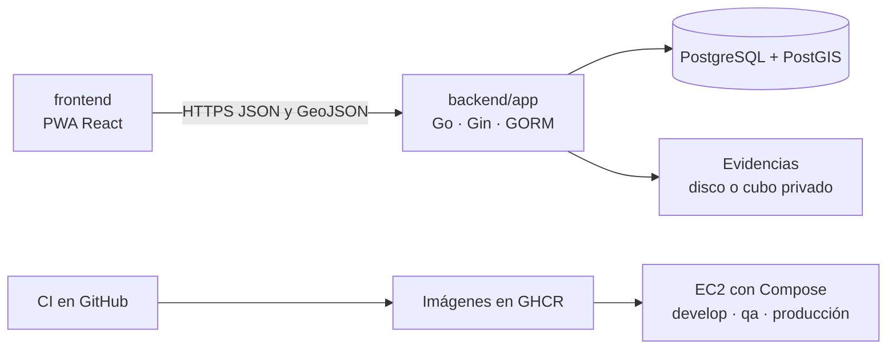

# VerdePUCP

VerdePUCP es el sistema de gestión de áreas verdes del campus PUCP (Pando): catastro, actividades, solicitudes, riego, inventario y reportes. El mapa es un módulo de la misma aplicación: no tiene backend propio.

La API que se despliega es `backend/app` (Go, Gin y GORM). El visor está en `frontend/`. La base es PostgreSQL con PostGIS. Las evidencias van a disco o, si se configura, a un cubo privado.

Licencia: [MIT](LICENSE).

## Arquitectura



Un solo proceso de API. Sin GeoServer, sin microservicios y sin `AutoMigrate`. El esquema lo aplican las migraciones de `db/migrations`.

## Estructura

```
backend/app       API que se despliega (también responde en /api/v1)
frontend          PWA (React, TypeScript, Vite, MapLibre)
db/migrations     esquema SQL. Fuente de verdad: 001_esquema_base.sql y 002_catalogos_base.sql
db/esquema.sql    foto generada del resultado. No se edita a mano
db/referencia     serie histórica y esquemas ajenos: no se aplican
deploy/           compose por ambiente, smoke, TLS y semilla ficticia
data/raw          fuentes del ETL (no editar a mano)
data/v1           GeoJSON normalizado (salida del ETL)
data/mocks        agenda ficticia
infra/            Terraform y Ansible del laboratorio
docs/             glosario, arquitectura, datos, protecciones, cambio de cuenta
scripts/          espera de Postgres, conteos, aprovisionamiento, esquema
```

## Cómo correrlo en local

Hace falta Docker (Compose v2), Go 1.25.3 para la API y Node 22 para el visor.

```bash
cp .env.example .env
docker compose up -d db
make wait
make migrate
make api
```

`make bootstrap` hace el compose de la base, la espera, las migraciones y el ETL. Después hay que arrancar la API con `make api`.

La API queda en **http://127.0.0.1:8091**.

```bash
curl -s http://127.0.0.1:8091/health
```

El visor, en otra terminal:

```bash
cd frontend
npm ci
npm run dev
```

Abre **http://127.0.0.1:4317**. Vite reenvía `/api`, `/areas-verdes` y `/health` a la API. Desde la raíz, `make web` es lo mismo que `npm run dev`.

Para ver el campus en el mapa, con la base ya migrada:

```bash
make etl
```

`make etl` carga `data/raw` (521 áreas y 534 sectores, entre otras capas). Si el catastro publicado ya está, no vuelve a truncar. El detalle está en [docs/DATOS-Y-ETL.md](docs/DATOS-Y-ETL.md).

El stack completo (PostGIS, API y nginx) en un solo origen:

```bash
docker compose up -d --build
```

La web de ese compose publica el puerto **8088**. Tres ambientes a la vez, en local:

```bash
make up ENV=develop
make smoke ENV=develop
make down ENV=develop
```

`make up` sin `ENV` levanta solo el Postgres del compose de la raíz. `make down` no usa `-v`: no borra volúmenes.

Si el puerto 5432 o el 8091 ya están ocupados:

```bash
POSTGRES_PORT=5442 API_PORT=8093 WEB_PORT=8089 make up ENV=develop
```

La clave de `.env.example` (`pando-local`) es de demostración local para las seis cuentas ficticias. No es una clave de la universidad. `.env` está en `.gitignore`.

## Roles

| Rol | Qué puede hacer en la interfaz |
| --- | --- |
| Capataz | Consultar y registrar. Ve Hoy, mapa, sus actividades, registros, bitácora y ejemplares. |
| Coordinación | Consultar, registrar, validar, solicitudes y reportes. También catastro, inventario, catálogos e importación. |
| Jefatura | Consultar, validar, reportes, solicitudes, evidencias y usuarios. No registra avances de campo. |
| Administración | Consultar, registrar, validar, reportes, catálogos, solicitudes y usuarios. |

La matriz que pinta las pestañas está en `frontend/src/ui/permisos.ts`. Los códigos de rol no se renombran. Las etiquetas visibles están en [docs/GLOSARIO-NOMENCLATURA.md](docs/GLOSARIO-NOMENCLATURA.md).

## Ambientes y cuentas de prueba

Las seis cuentas son ficticias en los tres ambientes: `norte`, `sur`, `riego`, `coordinacion`, `jefatura` y `admin`. La clave es distinta en cada ambiente. Aquí van marcadores; no hay claves reales en este archivo.

| Ambiente | URL | Notas |
| --- | --- | --- |
| develop | http://34.224.230.64:8088 | HTTP. Cookie no Secure. |
| QA | http://34.224.230.64:8188 | HTTP. Cookie no Secure. Misma máquina que develop. |
| producción | https://verde-pucp.duckdns.org | HTTPS cuando el certificado está instalado. |
| producción por IP | http://100.51.112.92 | La IP elástica responde. Por IP el certificado no coincide con el nombre. |

Esas IP de develop y de QA cambian si se apaga la instancia del laboratorio. Para apuntarlas de nuevo, [docs/CAMBIO-DE-CUENTA-LAB.md](docs/CAMBIO-DE-CUENTA-LAB.md).

### develop

| Usuario | Rol | Clave |
| --- | --- | --- |
| norte | Capataz, cuadrilla norte | `<<CLAVE_DEVELOP>>` |
| sur | Capataz, cuadrilla sur | `<<CLAVE_DEVELOP>>` |
| riego | Capataz, cuadrilla de riego | `<<CLAVE_DEVELOP>>` |
| coordinacion | Coordinación | `<<CLAVE_DEVELOP>>` |
| jefatura | Jefatura | `<<CLAVE_DEVELOP>>` |
| admin | Administración | `<<CLAVE_DEVELOP>>` |

### QA

| Usuario | Rol | Clave |
| --- | --- | --- |
| norte | Capataz, cuadrilla norte | `<<CLAVE_QA>>` |
| sur | Capataz, cuadrilla sur | `<<CLAVE_QA>>` |
| riego | Capataz, cuadrilla de riego | `<<CLAVE_QA>>` |
| coordinacion | Coordinación | `<<CLAVE_QA>>` |
| jefatura | Jefatura | `<<CLAVE_QA>>` |
| admin | Administración | `<<CLAVE_QA>>` |

### producción

| Usuario | Rol | Clave |
| --- | --- | --- |
| norte | Capataz, cuadrilla norte | `<<CLAVE_PRODUCCION>>` |
| sur | Capataz, cuadrilla sur | `<<CLAVE_PRODUCCION>>` |
| riego | Capataz, cuadrilla de riego | `<<CLAVE_PRODUCCION>>` |
| coordinacion | Coordinación | `<<CLAVE_PRODUCCION>>` |
| jefatura | Jefatura | `<<CLAVE_PRODUCCION>>` |
| admin | Administración | `<<CLAVE_PRODUCCION>>` |

En local, sin `APP_ENV`, las mismas cuentas entran con la clave de demostración de `.env.example` (`pando-local`). En producción la API rechaza `pando-local`, `campus-lab` y cualquier clave de menos de 16 caracteres.

## Cómo contribuir

El trabajo se integra en `develop`. `main` avanza por fast-forward desde `develop` y no despliega. No se hace force push ni se borra `main`.

| Qué | Dónde |
| --- | --- |
| Pruebas | `.github/workflows/ci.yml`: `test`, `backend`, `frontend`, `escaneo` (no bloqueante) y `e2e`. Un cambio solo de `*.md` o `docs/**` no dispara el CI. |
| Imágenes | El job `imagenes` publica `ghcr.io/<dueño>/backend-campus-verde:<sha>` y `frontend-campus-verde:<sha>` en push a `develop` o en un tag `rc-*`. |
| develop | Push a `develop` despliega solo si el CI de ese SHA está en verde. |
| QA | Tag `rc-*` o despliegue manual del mismo SHA que ya pasó por develop. |
| producción | Solo manual, desde `develop`, con el mismo SHA ya desplegado en QA y con la aprobación del environment. |

Las protecciones de rama y de environments están en [docs/PROTECCIONES-REPO.md](docs/PROTECCIONES-REPO.md). El detalle del pipeline está en [deploy/README.md](deploy/README.md).

## Documentación

| Documento | Para qué |
| --- | --- |
| [deploy/README.md](deploy/README.md) | CI/CD, ambientes, runners, promoción, HTTPS, rollback y verificación |
| [infra/README.md](infra/README.md) | Terraform, Ansible y los workflows de cuenta |
| [backend/README.md](backend/README.md) | API, migraciones, ETL, OpenAPI y variables |
| [frontend/README.md](frontend/README.md) | Visor, pruebas y permisos |
| [docs/INDICE.md](docs/INDICE.md) | Resto de la documentación |
