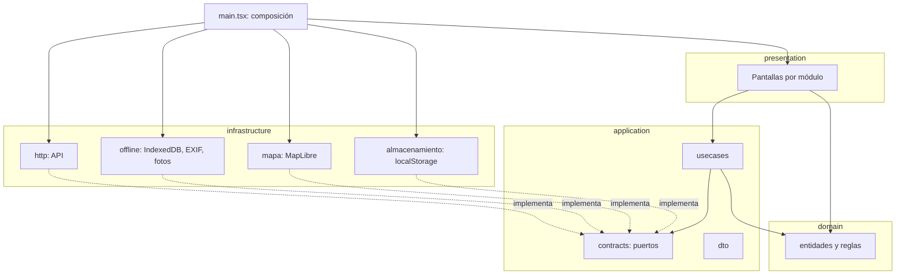

# Arquitectura propuesta del frontend

Propuesta. El código de `frontend/src` no se ha movido. El visor sigue compilando con la estructura actual (`api.ts`, `panel/`, `map/`, `offline/`, `ui/`).

El backend ya separa capas con estos nombres:

| Capa del backend | Dónde |
| --- | --- |
| Dominio | `backend/app/internal/domain` (entidades, constantes, errores) |
| Aplicación | `backend/app/internal/application/usecases`, `dto` |
| Puertos | `backend/app/internal/application/contracts` |
| Adaptadores | `backend/app/internal/infrastructure` |
| Presentación | `backend/app/internal/presentation` |
| Composición | `backend/app/cmd` y `backend/app/cmd/ioc` |

El visor usa los mismos nombres de capa. Las carpetas de módulo usan el vocabulario que ya tiene la interfaz (actividades, catastro, riego), no los códigos internos.

## Capas



La flecha punteada es «implementa». La continua es «puede importar». `main.tsx` es el único sitio que conoce a la vez la pantalla y el adaptador concreto, igual que `cmd/ioc` en el backend.

### Dominio

Reglas y tipos que no hablan con la red, con el mapa ni con React. Ejemplos que hoy ya son funciones puras: `validarPoda`, `validarVivero`, `validarArea`, `decisionClic`, `leerExif`, `fecha.ts`, `conteoCapas`.

No importa `application`, `infrastructure` ni `presentation`.

### Aplicación

Un caso de uso por acción de usuario: entrar, listar labores, encolar un cambio de estado, guardar un área, publicar la cola. Orquesta el dominio y llama puertos. No elige `fetch`, MapLibre ni IndexedDB.

### Puertos

Interfaces en `application/contracts`, el mismo papel que `ICargaInicialUseCase` y el resto de contratos del backend. El caso de uso depende de la interfaz. El adaptador la implementa.

Puertos que el código actual ya necesita, aunque hoy no existan como tipos:

| Puerto | Qué abstrae | Quién lo usa hoy, en concreto |
| --- | --- | --- |
| `IClienteHttp` | `fetch` con cookie y `apiUrl` | `api.ts`, `producto.send` |
| `IActividades` | altas, estados, listados, bitácora | `operacion.ts` |
| `ICatastro` | áreas, zonas, baja | `panel/catastro.ts` |
| `IColaOffline` | IndexedDB de labores, estados, evidencias y registros | `offline/queue.ts`, `offline/registros.ts` |
| `IMapa` | estilo, fuentes GeoJSON, dibujo y teselas | `map/CampusMap.tsx`, `map/draw.ts` |
| `IPreferencias` | rol local, equipo y color del mapa | `session.ts`, `map/panelMapa.ts` |

### Adaptadores

| Adaptador | Responsabilidad actual |
| --- | --- |
| `infrastructure/http` | Prefijo `/areas-verdes/v1` (`VITE_API_BASE`), `fetch` con `credentials: "include"`, errores HTTP (`ApiError`). |
| `infrastructure/offline` | Base `campus-verde` (versión 4): colas de labores, estados, evidencias y registros; compresión de foto; lectura EXIF. |
| `infrastructure/mapa` | MapLibre: estilo, teselas OSM, GeoJSON, dibujo de vértices, iconos de clase. |
| `infrastructure/almacenamiento` | `localStorage`: rol, equipo, color por uso o sector, panel de capas abierto o cerrado. |

### Presentación

React, CSS y textos visibles. Un directorio por módulo de la barra (`ui/registroModulos.ts`): hoy, resumen, mapa, labores, registros, catastro, inventario, solicitudes, reportes, catálogos, importaciones, cuentas, ejemplares, bitácora e historial. Poda, vivero y riego viven dentro de registros de campo. La nomenclatura (`ui/nomenclatura.ts`) se queda aquí: es copia de interfaz, no regla de negocio.

## Árbol propuesto

```
frontend/src/
  main.tsx                         composición: crea adaptadores y los inyecta
  vite-env.d.ts
  fonts.d.ts
  test/                            cargador de node --test; no es una capa
  domain/
    compartido/                    geo, fecha, errores de dominio
    actividades/                   estados, filtros, transiciones
    catastro/                      área, zona, validación, medidas
    inventario/
    riego/
    poda/
    vivero/
    solicitudes/
    ejemplares/
    calendario/
    mapa/                          clic, cobertura, clasificación de uso
    evidencias/                    EXIF puro
  application/
    contracts/                     puertos
    dto/
    usecases/                      un archivo por módulo
  infrastructure/
    http/
    offline/
    mapa/                          MapLibre
    almacenamiento/
  presentation/
    compartido/                    navegación, permisos, textos, BottomSheet, fecha visible
    app/                           marco de sesión (hoy App.tsx)
    actividades/                   Hoy, labores, filtros, resumen
    mapa/                          marco, control de capas, lista de actividades
    registros/                     poda, vivero, riego
    catastro/
    inventario/
    solicitudes/
    reportes/
    catalogos/
    importaciones/
    cuentas/
    ejemplares/
    bitacora/
    historial/
    estilos/                       styles.css
```

`e2e/` se queda en `frontend/e2e`. No entra en `src/`.

## Reglas de dependencia

| Desde | Puede importar | No puede importar |
| --- | --- | --- |
| `domain` | solo `domain` | `application`, `infrastructure`, `presentation`, React, `maplibre-gl` |
| `application` | `domain`, `application` | `infrastructure`, `presentation`, React |
| `infrastructure` | `domain`, `application/contracts`, `application/dto`, otros adaptadores del mismo directorio | `presentation`, casos de uso concretos |
| `presentation` | `domain`, `application`, `presentation` | `infrastructure` |
| `main.tsx` | todas | — |

`presentation` pide un caso de uso. No llama a `fetch` ni abre IndexedDB. El caso de uso pide un puerto. `main.tsx` pasa el adaptador.

Hoy esa regla no se cumple. `types.ts` importa `api.ts` y `ui/nomenclatura.ts`. `session.ts` importa `map/categorias`. `panel/catastro.ts` importa `map/draw.ts` para medir geometría. Esos tres cruces se deshacen en los primeros pasos, antes de mover pantallas.

### Cómo verificarlas

Cuando existan las carpetas, una regla de oxlint en `frontend/.oxlintrc.json` (`no-restricted-imports`) prohíbe los patrones de la tabla. Oxlint ya corre con `--max-warnings 0` en el job `frontend`. Un aviso nuevo falla el CI.

Complemento, porque oxlint no recorre alias ni imports dinámicos: un script `frontend/scripts/verificar-capas.mjs` lee los `import` estáticos de `src/**/*.{ts,tsx}` y sale con código 1 si una arista no está en la tabla. Se engancha al mismo job, después de `oxlint`. No hace falta otra dependencia.

Hasta que el código no se mueva, el script no se añade: hoy fallaría a propósito.

## Mapa del código actual

| Actual | Destino | Nota |
| --- | --- | --- |
| `src/main.tsx` | `src/main.tsx` | Sigue siendo la composición. |
| `src/App.tsx` | `presentation/app/App.tsx` | 1150 líneas. Orquesta mapa, cola y módulos. Se parte al final. |
| `src/api.ts` | `infrastructure/http/cliente.ts` | `apiUrl`, `fetchCollection`. |
| `src/types.ts` | `domain/compartido/geo.ts` y `presentation/mapa/capas.ts` | Tipos GeoJSON y `Rol` al dominio. `LAYERS` y `ROLES` (textos y rutas) a presentación. |
| `src/fecha.ts` | `domain/compartido/fecha.ts` | Sin imports. |
| `src/FechaCampo.tsx` | `presentation/compartido/FechaCampo.tsx` | |
| `src/session.ts` | `infrastructure/almacenamiento/preferencias.ts` | `localStorage`. Hoy importa `ColorPor` del mapa. |
| `src/inventario.ts` | `presentation/mapa/inventarioVisual.ts` | Colores y etiquetas de capas de puntos. |
| `src/operacion.ts` | `domain/actividades`, `application/usecases/actividades.ts`, `infrastructure/http/actividades.ts` | Mezcla reglas, `fetch` y el arreglo mutable `ESTADOS`. |
| `src/producto.ts` | casos de uso y adaptadores HTTP por módulo | Sesión, catálogos, fichas, solicitudes, órdenes, riego, evidencias, reportes, cuentas. |
| `src/styles.css` | `presentation/estilos/styles.css` | |
| `src/fonts.d.ts`, `src/vite-env.d.ts` | se quedan en `src/` | Declaraciones del compilador. |
| `src/test/` | `src/test/` | `register.mjs` y `tsx-loader.mjs`. |
| `src/map/CampusMap.tsx` | `infrastructure/mapa` (motor) y `presentation/mapa` (componente) | 759 líneas. El corte es el paso más delicado. |
| `src/map/draw.ts` | `domain/compartido/geometria.ts` y `infrastructure/mapa/draw.ts` | Tipos y medidas al dominio. El puente con MapLibre se queda en el adaptador. `catastro.ts` solo debe usar el dominio. |
| `src/map/cargaPlano.ts` | `domain/mapa/cargaPlano.ts` | Máquina de teselas, sin MapLibre. |
| `src/map/categorias.ts` | `domain/mapa/categorias.ts` y `infrastructure/mapa/estilosCategorias.ts` | Clasificación al dominio. Expresiones de estilo, que importan MapLibre, al adaptador. |
| `src/map/clicMapa.ts` | `domain/mapa/clicMapa.ts` | |
| `src/map/coverage.ts` | `domain/mapa/coverage.ts` | |
| `src/map/seleccionActividad.ts` | `application/usecases/seleccionarActividad.ts` | Coordina acciones. No dibuja. |
| `src/map/panelMapa.ts` | `infrastructure/almacenamiento/panelMapa.ts` | Preferencia en `localStorage`. |
| `src/map/trazosClase.ts` | `presentation/mapa/trazosClase.ts` | Trazos SVG. |
| `src/map/iconoClase.tsx` | `presentation/mapa/iconoClase.tsx` | |
| `src/map/ControlMapa.tsx` | `presentation/mapa/ControlMapa.tsx` | |
| `src/map/MarcoMapa.tsx` | `presentation/mapa/MarcoMapa.tsx` | |
| `src/map/MapBoundary.tsx` | `presentation/mapa/MapBoundary.tsx` | |
| `src/map/VistaActividades.tsx` | `presentation/mapa/VistaActividades.tsx` | |
| `src/offline/queue.ts` | `infrastructure/offline/queue.ts` | IndexedDB. Hoy importa reglas de `operacion.ts`: esas reglas pasan al dominio. |
| `src/offline/registros.ts` | `infrastructure/offline/registros.ts` | Publicar o encolar. |
| `src/offline/subida.ts` | `infrastructure/offline/subida.ts` | Evidencias con reintento. |
| `src/offline/comprimir.ts` | `infrastructure/offline/comprimir.ts` | |
| `src/offline/exif.ts` | `domain/evidencias/exif.ts` | Parser puro. El adaptador solo lo llama. |
| `src/offline/enganchar.ts` | `presentation/compartido/enganchar.ts` | Hook de React. |
| `src/panel/poda.ts` | `domain/poda/poda.ts` | Sin imports. Primer candidato a mover. |
| `src/panel/Poda.tsx` | `presentation/registros/Poda.tsx` | |
| `src/panel/vivero.ts` | `domain/vivero/vivero.ts` | Sin imports. |
| `src/panel/Vivero.tsx` | `presentation/registros/Vivero.tsx` | |
| `src/panel/Riego.tsx` | `presentation/registros/Riego.tsx` | El tipo y el `fetch` salen de `producto.ts`. |
| `src/panel/RegistrosCampo.tsx` | `presentation/registros/RegistrosCampo.tsx` | |
| `src/panel/Labores.tsx` | `presentation/actividades/Labores.tsx` | |
| `src/panel/FiltrosActividad.tsx` | `presentation/actividades/FiltrosActividad.tsx` | |
| `src/panel/Hoy.tsx` | `presentation/actividades/Hoy.tsx` | |
| `src/panel/Resumen.tsx` | `presentation/actividades/Resumen.tsx` | |
| `src/panel/catastro.ts` | `domain/catastro` y `infrastructure/http/catastro.ts` | Validación y CSV al dominio. `listar*` y `guardar*` al adaptador, detrás de un puerto. |
| `src/panel/Catastro.tsx` | `presentation/catastro/Catastro.tsx` | |
| `src/panel/CatastroEditor.tsx` | `presentation/catastro/CatastroEditor.tsx` | |
| `src/panel/zonificacion.ts` | `infrastructure/http/zonificacion.ts` y `domain/catastro/sector.ts` | Tipos de sector al dominio. Llamadas HTTP al adaptador. |
| `src/panel/SectoresCapataz.tsx` | `presentation/catastro/SectoresCapataz.tsx` | |
| `src/panel/SelectorLugar.tsx` | `presentation/compartido/SelectorLugar.tsx` | Lo usan catastro, labores y solicitudes. |
| `src/panel/inventarioCapas.ts` | `domain/inventario` y `infrastructure/http/inventario.ts` | Validadores al dominio. `enviarInventario` al adaptador. |
| `src/panel/InventarioCapas.tsx` | `presentation/inventario/InventarioCapas.tsx` | |
| `src/panel/CalendarioReservas.tsx` | `presentation/inventario/CalendarioReservas.tsx` | |
| `src/panel/calendario.ts` | `domain/calendario/calendario.ts` y `infrastructure/http/reservas.ts` | Fechas y rangos al dominio. `queryReservas` al adaptador. |
| `src/panel/ejemplares.ts` | `domain/ejemplares/ejemplares.ts` | Etiquetas que salen de `nomenclatura` se quedan en presentación. |
| `src/panel/Ejemplares.tsx` | `presentation/ejemplares/Ejemplares.tsx` | |
| `src/panel/Solicitudes.tsx` | `presentation/solicitudes/Solicitudes.tsx` | Tipos y `fetch` salen de `producto.ts`. |
| `src/panel/Reportes.tsx` | `presentation/reportes/Reportes.tsx` | |
| `src/panel/Catalogos.tsx` | `presentation/catalogos/Catalogos.tsx` | |
| `src/panel/importaciones.ts` | `domain/importaciones/entidades.ts` y `infrastructure/http/importaciones.ts` | La lista de entidades al dominio. El POST al adaptador. |
| `src/panel/Importaciones.tsx` | `presentation/importaciones/Importaciones.tsx` | |
| `src/panel/Admin.tsx` | `presentation/cuentas/Admin.tsx` | |
| `src/panel/Login.tsx` | `presentation/cuentas/Login.tsx` | |
| `src/panel/Auditoria.tsx` | `presentation/historial/Auditoria.tsx` | |
| `src/panel/bitacora.ts` | `application/usecases/bitacora.ts` y `infrastructure/http/bitacora.ts` | |
| `src/panel/Bitacora.tsx` | `presentation/bitacora/Bitacora.tsx` | |
| `src/panel/EvidenciasCampo.tsx` | `presentation/bitacora/EvidenciasCampo.tsx` | |
| `src/panel/Modulos.tsx` | se elimina al mover cada panel | Solo reexporta. Cada pantalla importa su módulo. |
| `src/ui/nomenclatura.ts` | `presentation/compartido/nomenclatura.ts` | Textos visibles. |
| `src/ui/permisos.ts` | `domain/accesos/permisos.ts` | Matriz de acciones. No pinta. |
| `src/ui/registroModulos.ts` | `presentation/compartido/registroModulos.ts` | Orden de pestañas. Usa el dominio de permisos. |
| `src/ui/navegacion.ts` | `presentation/compartido/navegacion.ts` | |
| `src/ui/ayuda.ts` | `presentation/compartido/ayuda.ts` | |
| `src/ui/AyudaTip.tsx` | `presentation/compartido/AyudaTip.tsx` | |
| `src/ui/Recorrido.tsx` | `presentation/compartido/Recorrido.tsx` | |
| `src/ui/BottomSheet.tsx` | `presentation/compartido/BottomSheet.tsx` | |
| `src/ui/bottomSheet.ts` | `presentation/compartido/bottomSheet.ts` | |
| `src/ui/desplazar.ts` | `presentation/compartido/desplazar.ts` | |
| `src/ui/media.ts` | `presentation/compartido/media.ts` | |
| `src/ui/teclado.ts` | `presentation/compartido/teclado.ts` | |
| `src/ui/Esqueleto.tsx` | `presentation/compartido/Esqueleto.tsx` | |
| `src/**/*.test.ts` | junto al archivo que cubren | El runner de `package.json` lista cada ruta. Al mover un archivo se actualiza esa lista en el mismo cambio. |

## Plan de migración

Cada paso deja `npm test`, `oxlint --max-warnings 0` y `tsc -b && vite build` en verde, y no cambia lo que ve el usuario. Al mover un archivo se deja un reexport en la ruta vieja hasta el paso en que ya nadie la importa. Así el e2e no depende del orden interno.

1. **Poda.** Mover `panel/poda.ts` a `domain/poda` y reexportarlo. `Poda.tsx` no se toca salvo el import. `atencion.test.ts` ya prueba `validarPoda` aparte del panel.
2. **Vivero.** Igual con `panel/vivero.ts`. Misma forma, cero imports.
3. **Fecha y geometría pura.** `fecha.ts`, `clicMapa.ts`, `coverage.ts`, `cargaPlano.ts` y la parte de `draw.ts` que no importa MapLibre (`Position`, `MultiPolygon`, medidas, errores). `CatastroEditor` sigue llamando las mismas funciones.
4. **Permisos.** `permisos.ts` al dominio. `registroModulos.ts` se queda en presentación e importa el dominio.
5. **Cliente HTTP.** Extraer `apiUrl` y `ApiError` a `infrastructure/http` sin cambiar firmas. El resto sigue importando el reexport.
6. **Ejemplares, calendario e inventario de validación.** Solo las funciones puras (`puedeEditarEjemplar`, `rangoDe`, `validarConteos`, `validarBebedero`). Las pantallas se quedan.
7. **Catastro de dominio.** `validarArea`, `validarZona`, payloads y CSV. Las funciones `listar*` y `guardar*` siguen en `panel/catastro.ts` hasta el paso del puerto.
8. **Actividades.** Separar reglas (`puedeEncolarEstado`, filtros, estados) de los `fetch*` de `operacion.ts`. El arreglo global `ESTADOS` pasa a un valor devuelto por el caso de uso, no a un `splice` de módulo: es el cambio de comportamiento interno más fácil de romper y va con sus pruebas (`catalogos.test.ts`, `filtrosActividad.test.ts`).
9. **Partir `producto.ts` por módulo** (sesión, catálogos, solicitudes, órdenes, riego, reportes, cuentas). Una función pública por commit, con reexport.
10. **Puertos y cola.** Definir `IColaOffline` e `IActividades`. `offline/` pasa a `infrastructure/offline` e implementa el puerto. `queue.ts` deja de importar `operacion.ts`.
11. **Mapa.** Último. Extraer el motor de `CampusMap.tsx` detrás de `IMapa`. El componente React se queda en presentación y recibe el puerto. No se mezcla con otro paso.
12. **`App.tsx`.** Cuando los puertos existan, el marco solo compone. Hasta entonces no se parte.
13. **Regla de lint y script de aristas.** Se encienden cuando el árbol nuevo ya tiene código. Antes no.

El e2e (29 pruebas) se corre al cerrar los pasos 8, 11 y 12. En los demás basta la unidad, porque no cambian pantallas.

## Riesgos

- **`App.tsx` concentra el estado** (capas, cola, módulo activo, dibujo). Partirlo antes de los puertos obliga a pasar decenas de props o a copiar estado. Por eso va al final.
- **`ESTADOS` se muta** con `aplicarEstadosCatalogo`. Si el dominio lo importa como constante y el adaptador lo reemplaza, dos pantallas pueden ver listas distintas. El paso 8 tiene que dejar un solo dueño.
- **`types.ts` no es solo dominio.** `LAYERS` llama a `apiUrl` y a `CAPA`. Mover el archivo entero al dominio arrastra HTTP y textos. Hay que partirlo en el paso 5, no antes.
- **`draw.ts` es el puente del catastro con el mapa.** Si la medición se queda junto a MapLibre, el dominio de catastro sigue dependiendo del adaptador. La geometría pura sale en el paso 3.
- **Las pruebas unitarias listan archivos en `package.json`** y varias importan `.tsx` con el cargador de `src/test`. Un movimiento sin actualizar esa lista, o sin el sufijo `.ts` que el runner exige, deja de ejecutar pruebas sin que el build falle.
- **La cola usa IndexedDB versión 4** y claves (`campus-verde`, `cola-labores`, `campus-cola-vaciada`, `cv:colorPor`). Cambiar un nombre borra o esconde lo que el capataz tenía en el navegador. El adaptador conserva esos literales.
- **MapLibre y el service worker** se registran en `main.tsx` con efectos de arranque. Moverlos de sitio sin mantener el orden (fuentes, worker, `registerSW`) rompe el plano aunque `tsc` pase. El paso 11 se verifica en el navegador, no solo con `vite build`.
- **Reexports eternos.** Si un reexport de la ruta vieja se queda, la regla de dependencias no ve el cruce. Cada paso borra el reexport cuando el import nuevo es el único.
