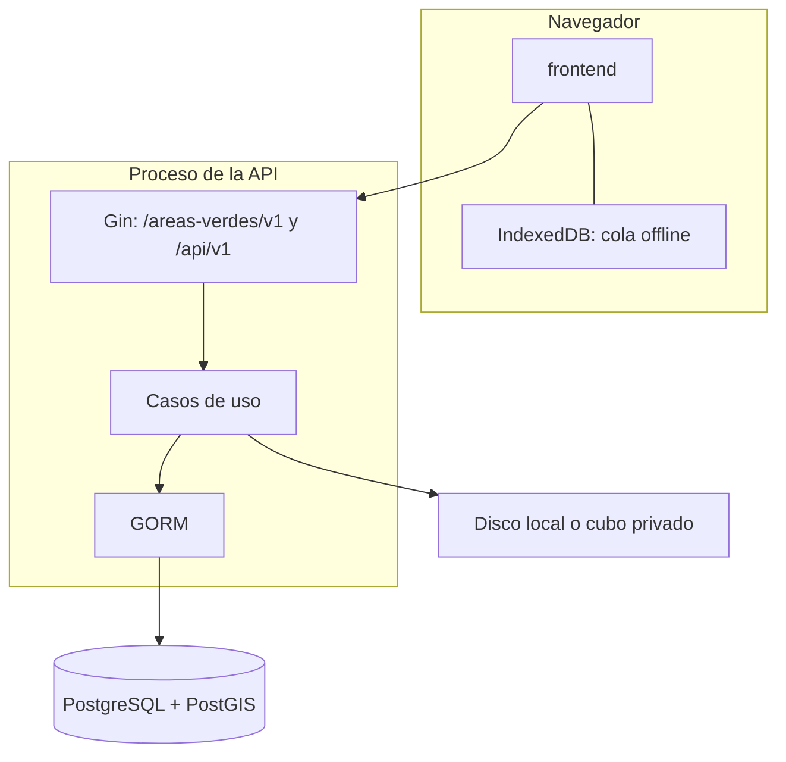

# Arquitectura

VerdePUCP gestiona las áreas verdes del campus PUCP (Pando). Un solo backend y una PWA. El mapa consume la misma API.

## Contenedores

| Pieza | Dónde | Notas |
| --- | --- | --- |
| PWA | `frontend` | React, TypeScript, Vite, MapLibre. Teselas OSM. |
| API en servicio | `backend/app` | Go, Gin, GORM, inyección con `dig`. Un solo módulo. |
| Esquema | `db/migrations` | SQL aditivo e idempotente. Lo aplica `cmd/migrate`. |
| Objetos | `EVIDENCIAS_DIR` o `EVIDENCIAS_BUCKET` | La base guarda la clave del archivo, no una URL pública. |

No hay GeoServer, Redis, bus de eventos ni plataforma de BI. El estilo es un monolito modular: controlador → caso de uso → repositorio.

## Módulos

| Módulo | Qué cubre |
| --- | --- |
| Accesos | Cuentas locales, cookie `cv_sesion`, roles y permisos. No hay SSO. |
| Catálogos | Tipos, estados, lugares, especies. Se desactivan; no se borran. |
| Catastro | Áreas, sectores de capataz, ejemplares. Un registro puede no tener geometría. |
| Operación | Actividades, riego, evidencias, bitácora. El alta lleva UUID de cliente. |
| Atención | Solicitudes y órdenes de servicio tercerizado. |
| Reportes | Consultas a Postgres. CSV o XLS. Sin PDF. |
| Mapa | Capas y pines. No es un almacén distinto. |

La sesión es una cookie HttpOnly. `CAMPUS_COOKIE_SECURE` solo se enciende con HTTPS. En develop, QA y en local queda en falso.

## Datos

EPSG:4326. Un polígono de origen se guarda como MultiPolygon. El ETL no persiste el campo `jefes` de la fuente: las cuadrillas de demostración tienen nombres ficticios.

Develop y QA pueden recibir, además de la carga, la semilla de [deploy/seed/ficticio.sql](../deploy/seed/ficticio.sql). Producción no la recibe. El procedimiento está en [DATOS-Y-ETL.md](DATOS-Y-ETL.md).

## Ambientes

El mismo código corre en develop, QA y producción, cada uno con su base. La promoción de un commit es develop → QA → producción. El pipeline está en [deploy/README.md](../deploy/README.md). La máquina del laboratorio se describe en [../infra/README.md](../infra/README.md).
