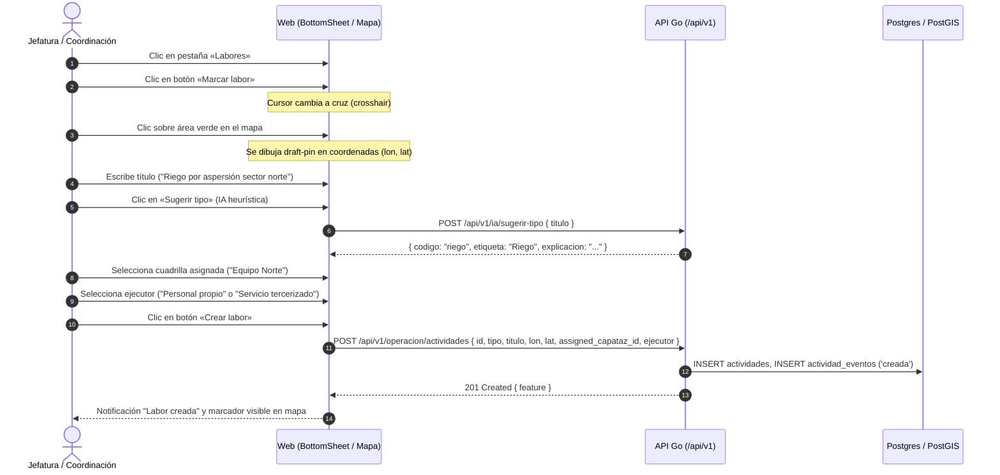
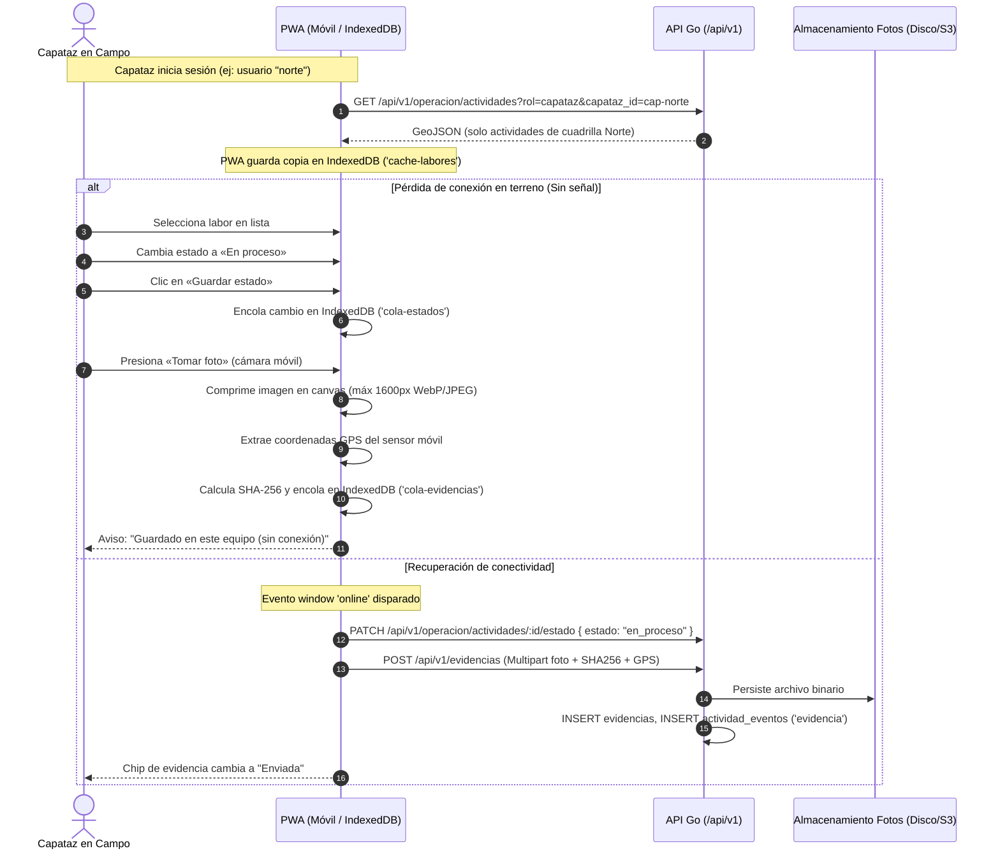
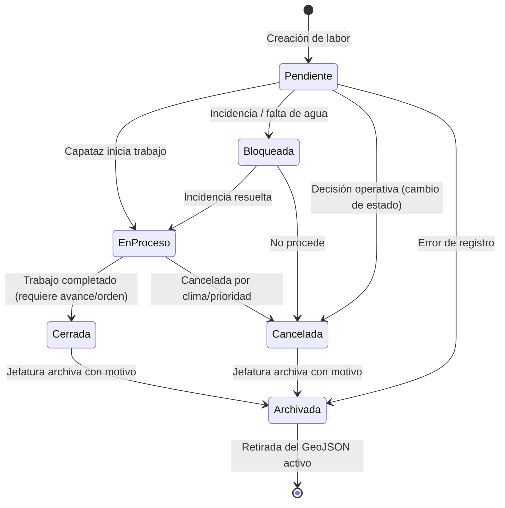
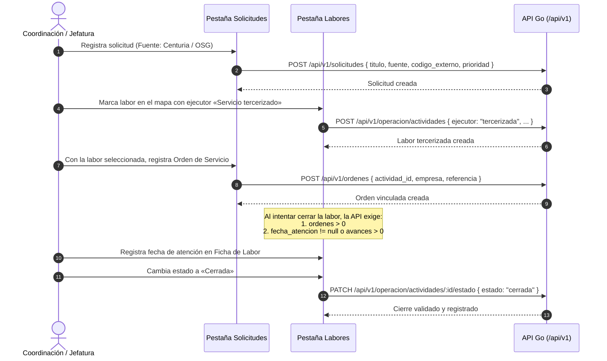
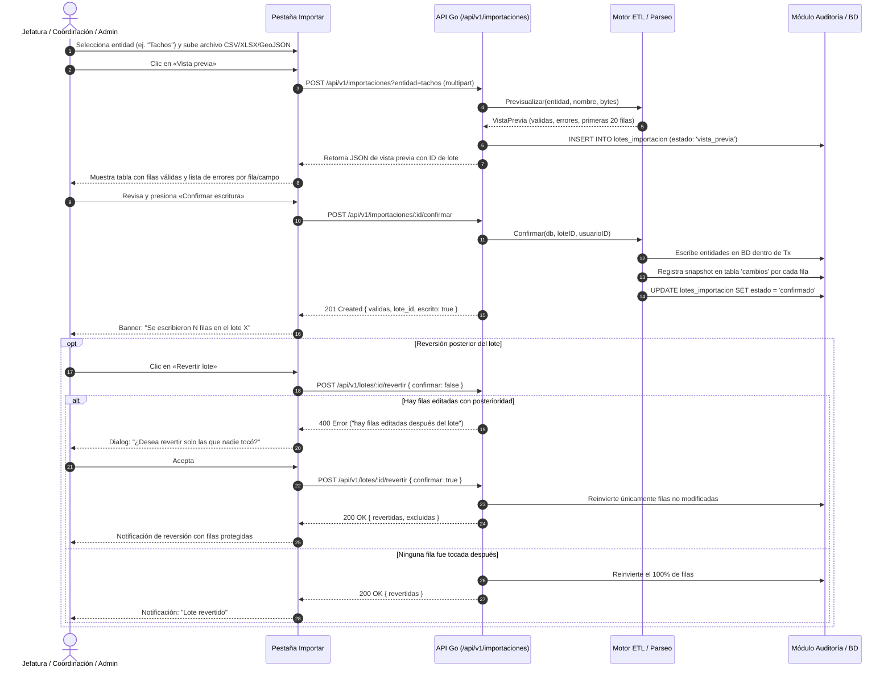

# Guía Funcional de Pestañas, Pantallas y Flujos de VerdePUCP

Esta guía describe el funcionamiento integral, pantallas, roles, permisos y flujos de trabajo de la aplicación web y PWA de **VerdePUCP** (gestión de áreas verdes del campus universitario PUCP). Todo el contenido está fundamentado estrictamente en el código fuente actual del frontend React ([`apps/web/src`](../apps/web/src)) y del backend Go Gin/GORM ([`apps/api/internal`](../apps/api/internal)).

---

## 1. Tabla de Roles y Matriz de Acceso

El sistema maneja un conjunto de roles técnicos en base de datos y sesión local. En el **Backlog v2** ([RF-02](fuente/Product_Backlog_Areas_Verdes_v2.xlsm), [RF-32](fuente/Product_Backlog_Areas_Verdes_v2.xlsm)), se establecen las denominaciones funcionales oficiales y se ratifica que los operarios no poseen cuentas individuales en el MVP.

### 1.1. Correspondencia de Roles

| Rol Técnico en Código | Nombre Funcional Backlog v2 | Ubicación / Entorno | Cuentas Semilla Locales ([`accesos.go`](../apps/api/internal/accesos/accesos.go#L31-L38)) | Propósito y Alcance Operativo |
| :--- | :--- | :--- | :--- | :--- |
| `capataz` | **Capataz** | Campo (móvil PWA) | `norte` (`cap-norte`), `sur` (`cap-sur`), `riego` (`cap-riego`) | Supervisión directa de cuadrilla en campo. Ve únicamente labores asignadas a su equipo, reporta inicio/término, registra turnos de riego y captura evidencias fotográficas con o sin conexión. |
| `coordinacion` | **Ingeniería / Coordinación** | Oficina / Campo | `coordinacion` | Planificación técnica, programación de actividades, asignación de cuadrillas, control de avance, catastro y gestión de proveedores tercerizados. |
| `jefatura` | **Jefatura** | Oficina | `jefatura` | Supervisión general del servicio, validación de labores, revisión de reportes consolidados y atención de solicitudes institucionales. |
| `admin` | **Administrador del sistema** | Oficina / Técnico | `admin` | Parametrización de catálogos maestros, configuración de valores de negocio, auditoría de usuarios y permisos semilla. |
| *(sin cuenta)* | **Operarios de campo** | Campo | *(No aplica)* | Según **RF-02**, en el MVP los operarios ejecutan labores bajo la supervisión de su respectivo Capataz y no requieren credenciales individuales. |

> [!NOTE]
> En adelante en este documento, se empleará la denominación funcional del Backlog v2 seguida del identificador técnico entre paréntesis: por ejemplo, **Capataz (`capataz`)** o **Ingeniería/Coordinación (`coordinacion`)**.

---

### 1.2. Matriz de Permisos del Backend

En [`apps/api/internal/accesos/accesos.go`](../apps/api/internal/accesos/accesos.go#L40-L46), la variable [`Matriz`](../apps/api/internal/accesos/accesos.go#L41) define las capacidades autorizadas en la API:

```go
var Matriz = map[string][]string{
    "capataz":      {"consultar", "registrar"},
    "coordinacion": {"consultar", "registrar", "validar", "solicitudes", "reportes"},
    "jefatura":     {"consultar", "validar", "reportes", "solicitudes"},
    "admin":        {"consultar", "registrar", "validar", "reportes", "catalogos", "solicitudes"},
}
```

Las verificaciones en los controladores HTTP se realizan mediante la función [`exige(c, accion)`](../apps/api/internal/handlers/producto.go#L39-L50) y [`actorDeSesion(c, capatazCuerpo)`](../apps/api/internal/handlers/producto.go#L27-L37):
1. **`consultar`**: Lectura de catastro, inventario, bitácoras y registros.
2. **`registrar`**: Creación de registros operativos (riego, evidencias fotográficas, fichas de área, altas en inventario, podas y vivero). *(Nota técnica: la Jefatura no tiene la acción `registrar`, por lo que delega el llenado de fichas operativas a Coordinación/Capataz)*.
3. **`validar`**: Creación de labores en el mapa ([`operacion.Create`](../apps/api/internal/handlers/operacion.go#L117)), asignación de cuadrillas ([`operacion.Assign`](../apps/api/internal/handlers/operacion.go#L157)), archivo de labores ([`operacion.Archive`](../apps/api/internal/handlers/operacion.go#L225)), y confirmación de lotes de importación masiva ([`importaciones.Confirmar`](../apps/api/internal/handlers/importaciones.go#L98)).
4. **`solicitudes`**: Acceso al módulo de solicitudes externas/internas y su vinculación.
5. **`reportes`**: Generación y exportación de métricas y reportes operativos (CSV/XLS).
6. **`catalogos`**: Alta y desactivación lógica de elementos maestros en catálogos configurables.

---

### 1.3. Visibilidad de Módulos en la Interfaz Web

En [`apps/web/src/App.tsx`](../apps/web/src/App.tsx#L55-L60), la función [`modulosDe(rol)`](../apps/web/src/App.tsx#L55) determina las pestañas accesibles en la barra de navegación:

| Módulo (Pestaña) | ID Módulo | Capataz (`capataz`) | Jefatura (`jefatura`) | Ingeniería / Coordinación (`coordinacion`) | Admin (`admin`) |
| :--- | :--- | :---: | :---: | :---: | :---: |
| **Mapa** | `mapa` | Sí | Sí | Sí | Sí |
| **Labores** | `labores` | Sí *(solo su cuadrilla)* | Sí *(todas)* | Sí *(todas)* | Sí *(todas)* |
| **Catastro** | `catastro` | Sí *(solo lectura de fichas)* | Sí | Sí | Sí |
| **Inventario** | `inventario` | Sí | Sí | Sí | Sí |
| **Solicitudes** | `solicitudes` | No | Sí | Sí | Sí |
| **Reportes** | `reportes` | No | Sí | Sí | Sí |
| **Catálogos** | `catalogos` | No | No | Sí *(solo lectura)* | Sí *(edición total)* |
| **Importar** | `importaciones` | No | Sí | Sí | Sí |
| **Admin** | `admin` | No | No | No | Sí |

---

## 2. Inventario Exhaustivo de Pantallas y Pestañas

### 2.1. Pantalla de Acceso (Login)

* **Propósito**: Identificación de usuario y establecimiento de sesión mediante cookie HTTP segura (`cv_sesion`, 12 horas de vigencia).
* **Quién la usa**: Todos los roles antes de acceder a la aplicación.
* **Componente Frontend**: [`Login`](../apps/web/src/panel/Modulos.tsx#L30-L79) en [`apps/web/src/panel/Modulos.tsx`](../apps/web/src/panel/Modulos.tsx).
* **Acciones permitidas**:
  * Ingreso de credenciales locales (campo `usuario` y `clave`).
  * Autenticación contra base de datos Postgres (contraseñas con hash bcrypt).
  * Desconexión / cierre de sesión mediante botón «Salir» en cabecera ([`App.tsx`](../apps/web/src/App.tsx#L606)).
* **Endpoints API**:
  * `POST /api/v1/sesion`: Valida usuario y contraseña; establece cookie `cv_sesion` ([`Sesion.Entrar`](../apps/api/internal/handlers/producto.go#L125-L145)).
  * `GET /api/v1/sesion`: Comprueba sesión activa y retorna perfil ([`Sesion.Actual`](../apps/api/internal/handlers/producto.go#L147-L154)).
  * `DELETE /api/v1/sesion`: Invalida token y borra cookie ([`Sesion.Salir`](../apps/api/internal/handlers/producto.go#L156-L162)).

---

### 2.2. Pestaña «Mapa»

* **Propósito**: Exploración geoespacial del campus PUCP en 2D o 3D (relieve), visualización de polígonos catastrales, sectores operativos, superposiciones de inventario y agenda rápida de reservas.
* **Quién la usa**: Todos los roles.
* **Componentes Frontend**:
  * Contenedor y capas en panel lateral: [`App.tsx`](../apps/web/src/App.tsx#L665-L751).
  * Visor cartográfico: [`CampusMap`](../apps/web/src/map/CampusMap.tsx#L115-L598) en [`apps/web/src/map/CampusMap.tsx`](../apps/web/src/map/CampusMap.tsx).
  * Calendario integrado: [`CalendarioReservas`](../apps/web/src/panel/CalendarioReservas.tsx#L43-L166).
* **Qué se puede hacer**:
  * **Alternar vista 2D Plano vs 3D Relieve**: Botones en cabecera ([`App.tsx`](../apps/web/src/App.tsx#L601-L603)). La vista en relieve extruye polígonos según su superficie y levanta huellas de edificios OSM.
  * **Conmutar capas base**: Activar/desactivar Edificios OSM, Áreas verdes, Zonas (sectores de supervisión), Jardines de reserva y Xerofítica.
  * **Colorear y filtrar catastro**: Segmentado entre «Uso del área» (Jardines, Bosque, Islas, etc.) y «Sector operativo» (Norte, Sur, etc.). Permite apagar categorías individuales mediante checkboxes en la leyenda.
  * **Superponer capas de inventario físico**: Bebederos, fauna, puertas, tachos de residuos, flora, cafetos, playas de estacionamiento, veredas en riesgo.
  * **Consultar información al hacer clic**: Abre popups interactivos con detalles, fotos de campo vinculadas a inventario ([`/fotos/:name`](../apps/api/internal/handlers/inventario.go#L68)) o datos catastrales.
  * **Consultar reservas**: Calendario mensual/semanal/diario al pie del panel.
* **Endpoints API**:
  * `GET /api/v1/geo/areas`: GeoJSON de polígonos de áreas verdes ([`Geo.Areas`](../apps/api/internal/handlers/geo.go#L149)).
  * `GET /api/v1/geo/zonas`: GeoJSON de polígonos de sectores de supervisión ([`Geo.Zonas`](../apps/api/internal/handlers/geo.go#L150)).
  * `GET /api/v1/geo/edificios`: Huellas de edificios del campus ([`Geo.Edificios`](../apps/api/internal/handlers/geo.go#L153)).
  * `GET /api/v1/geo/capas/:capa`: GeoJSON de capas secundarias como `jardines_reserva` o `xerofitica` ([`Geo.Capa`](../apps/api/internal/handlers/geo.go#L152)).
  * `GET /api/v1/geo/inventario/:capa`: GeoJSON de inventario ([`Inventario.Capa`](../apps/api/internal/handlers/inventario.go#L64)).
  * `GET /api/v1/geo/inventario/fotos/:name`: Imágenes recuperadas del inventario ([`Inventario.Foto`](../apps/api/internal/handlers/inventario.go#L68-L85)).
  * `GET /api/v1/inventario/reservas`: Agenda de reservas para el calendario ([`Frente2B.listarReservas`](../apps/api/internal/handlers/frente2b.go#L42)).

---

### 2.3. Pestaña «Labores»

* **Propósito**: Centro operativo principal del sistema. Control de ciclo de vida de labores, asignación a cuadrillas, registro de ejecución, bitácora de eventos, evidencias fotográficas offline y submódulos de Riego, Poda y Vivero.
* **Quién la usa**:
  * **Capataz (`capataz`)**: Consulta labores asignadas a su cuadrilla, cambia estados a `en_proceso` o `cerrada`, toma fotografías de evidencia en terreno y registra turnos de riego.
  * **Ingeniería/Coordinación (`coordinacion`)** y **Jefatura (`jefatura`)**: Crean labores marcando pines en el mapa, asignan/reasignan cuadrillas, definen ejecutor propio o tercerizado, consultan la bitácora completa, archivan labores y llenan fichas de solicitud/atención.
* **Componentes Frontend**:
  * Panel principal: [`Labores`](../apps/web/src/panel/Labores.tsx#L79-L315) en [`apps/web/src/panel/Labores.tsx`](../apps/web/src/panel/Labores.tsx).
  * Formulario de metadatos de labor: [`FichaLabor`](../apps/web/src/panel/Labores.tsx#L317-L389).
  * Evidencias y cámara: [`EvidenciasCampo`](../apps/web/src/panel/EvidenciasCampo.tsx#L64-L312) en [`apps/web/src/panel/EvidenciasCampo.tsx`](../apps/web/src/panel/EvidenciasCampo.tsx).
  * Subpaneles acoplados: [`RiegoPanel`](../apps/web/src/panel/Modulos.tsx#L708-L828), [`PodaPanel`](../apps/web/src/panel/Poda.tsx#L11-L172), [`ViveroPanel`](../apps/web/src/panel/Vivero.tsx#L13-L173).
* **Qué se puede hacer**:
  1. **Filtrar labores**: Por cuadrilla/equipo (solo oficina), por tipo de labor (`riego`, `poda`, `limpieza`, `incidencia`, `inspeccion`), y por estado operativo (`pendiente`, `en_proceso`, `bloqueada`).
  2. **Crear labor en el mapa** (*solo Jefatura, Coordinación o Admin*):
     * Clic en botón «Marcar labor». El cursor del mapa pasa a cruz (`crosshair`).
     * Clic en el mapa para fijar latitud y longitud (`draft-pin`).
     * Asignación de título (máx. 160 caracteres), tipo de labor, ejecutor (`propia` o `tercerizada`), cuadrilla asignada y detalle (hasta 2000 caracteres).
     * **Sugerencia con IA**: Botón «Sugerir tipo» que llama a un clasificador heurístico local ([`sugerirTipo`](../apps/web/src/producto.ts#L305-L308)) para sugerir la categoría adecuada a partir del título.
     * En caso de no haber conexión, la labor se encola en IndexedDB local ([`queue.ts`](../apps/web/src/offline/queue.ts#L44)).
  3. **Seleccionar y visualizar detalle**: Al hacer clic en una labor (en lista o marcador de mapa), se enfoca la cámara en el mapa y se muestra su información completa.
  4. **Cambiar estado operativo**:
     * Selección de nuevo estado (`pendiente`, `en_proceso`, `bloqueada`, `cerrada`, `cancelada`).
     * Los capataces solo pueden cambiar el estado si la labor está asignada a su cuadrilla ([`store.go:299`](../apps/api/internal/operacion/store.go#L299)).
     * Para pasar a `cerrada`, el backend valida que exista ejecución registrada (`fecha_atencion` en ficha o avance registrado) y, si es tercerizada, que posea una orden de servicio vinculada ([`PuedeCerrar`](../apps/api/internal/operacion/validate.go#L154)).
  5. **Reasignar cuadrilla** (*oficina*): Cambia el equipo responsable e inserta evento en bitácora.
  6. **Archivar labor** (*oficina*): Requiere seleccionar un motivo de archivo configurable y doble confirmación. La labor se retira del GeoJSON abierto.
  7. **Guardar Ficha de la Labor**: Ingreso de fechas de solicitud y atención, lugar físico aproximado y comentarios.
  8. **Adjuntar Evidencias Fotográficas** ([`EvidenciasCampo`](../apps/web/src/panel/EvidenciasCampo.tsx#L64)):
     * Botón «Tomar foto» (dispara la cámara del dispositivo móvil con `capture="environment"`) o «Elegir archivo».
     * Compresión automática en el navegador (redimensionamiento a máx. 1600px en WebP/JPEG, calidad 0.82) para reducir consumo de datos móviles.
     * Extracción de coordenadas EXIF originales o captura por Geolocation API del navegador.
     * Encolamiento transparente en IndexedDB si el operario no tiene señal de red, con reintentos automáticos mediante backoff exponencial al detectar conectividad.
  9. **Consultar Bitácora (Timeline)**: Lista ordenada cronológicamente de todas las transacciones ocurridas sobre la labor (creada, asignada, cambio de estado, evidencia adjuntada, archivada) con fecha, hora y rol/usuario actor.
* **Endpoints API**:
  * `GET /api/v1/operacion/actividades`: GeoJSON de labores abiertas ([`Operacion.List`](../apps/api/internal/handlers/operacion.go#L81)). Si el rol es `capataz`, filtra automáticamente por `capataz_id`.
  * `POST /api/v1/operacion/actividades`: Alta de labor ([`Operacion.Create`](../apps/api/internal/handlers/operacion.go#L116)).
  * `PATCH /api/v1/operacion/actividades/:id/estado`: Cambio de estado operativo ([`Operacion.Estado`](../apps/api/internal/handlers/operacion.go#L187)).
  * `PATCH /api/v1/operacion/actividades/:id/asignacion`: Reasignación de cuadrilla ([`Operacion.Assign`](../apps/api/internal/handlers/operacion.go#L156)).
  * `POST /api/v1/operacion/actividades/:id/archivar`: Archivo lógico con motivo ([`Operacion.Archive`](../apps/api/internal/handlers/operacion.go#L224)).
  * `PATCH /api/v1/operacion/actividades/:id/ficha`: Actualización de ficha complementaria ([`Operacion.Ficha`](../apps/api/internal/handlers/operacion.go#L254)).
  * `GET /api/v1/operacion/actividades/:id/timeline`: Bitácora histórica de eventos ([`Operacion.Timeline`](../apps/api/internal/handlers/operacion.go#L275)).
  * `POST /api/v1/evidencias`: Subida multipart de evidencia con hash SHA-256 idempotente y coordenadas ([`Atencion.SubirEvidencia`](../apps/api/internal/handlers/producto.go#L524)).
  * `GET /api/v1/evidencias`: Listado de evidencias por actividad ([`Atencion.Evidencias`](../apps/api/internal/handlers/producto.go#L509)).
  * `GET /api/v1/evidencias/:id/archivo`: Descarga / visualización del binario de imagen o documento ([`Atencion.Archivo`](../apps/api/internal/handlers/producto.go#L544)).
  * `POST /api/v1/ia/sugerir-tipo`: Regla heurística de clasificación de tipo ([`Atencion.Sugerir`](../apps/api/internal/handlers/producto.go#L608)).
  * `GET /api/v1/riego` y `POST /api/v1/riego`: Consulta y registro de turnos de riego ([`Atencion.Riego`](../apps/api/internal/handlers/producto.go#L453-L507)).
  * `GET /api/v1/podas` y `POST /api/v1/podas`: Listado y registro de incidencias de poda ([`PodaVivero.ListarPodas`](../apps/api/internal/handlers/poda.go#L46-L80)).
  * `GET /api/v1/vivero` y `POST /api/v1/vivero`: Listado y registro de procesos de vivero ([`PodaVivero.ListarVivero`](../apps/api/internal/handlers/poda.go#L118-L151)).

---

### 2.4. Pestaña «Catastro»

* **Propósito**: Mantenimiento del inventario territorial maestro: edición de atributos alfanuméricos de áreas verdes y zonas de supervisión, modificación interactiva de vértices geométricos en el mapa y exportación CSV.
* **Quién la usa**: Jefatura (`jefatura`), Ingeniería/Coordinación (`coordinacion`), Administrador (`admin`) y Capataz (`capataz`) *(en modo consulta)*.
* **Componente Frontend**: [`CatastroEditor`](../apps/web/src/panel/CatastroEditor.tsx#L104-L757) en [`apps/web/src/panel/CatastroEditor.tsx`](../apps/web/src/panel/CatastroEditor.tsx).
* **Qué se puede hacer**:
  * **Alternar entidad**: Selector entre «Áreas verdes» (`area`) y «Zonas de supervisión» (`zona`).
  * **Buscar y filtrar**: Búsqueda por texto en tiempo real sobre nombre, código, identificador (`feature_id`) y uso.
  * **Editar ficha técnica**: Modificar nombre, código, uso clasificado ([`USOS_AREA`](../apps/web/src/panel/catastro.ts#L4)), proyecto de riego ([`PROYECTOS_RIEGO`](../apps/web/src/panel/catastro.ts#L13)), tipo de riego actual, referencia descriptiva, perímetro en metros y área en m².
  * **Edición geométrica interactiva en el mapa**:
    * Botón «Editar geometría»: activa el modo dibujo sobre el mapa ([`CampusMap`](../apps/web/src/map/CampusMap.tsx#L581-L595)).
    * Los vértices del polígono se marcan en pantalla. Permite arrastrar vértices directamente con el mouse o seleccionarlos y ajustarlos finamente con teclas de flecha (paso de `0.00005` grados).
    * Cálculo automático en tiempo real del área y perímetro resultantes según la fórmula de Shoelace/Haversine ([`medirGeom`](../apps/web/src/map/draw.ts)). Alerta en pantalla si las medidas numéricas tipeadas discrepan en más de 10% con la geometría real.
  * **Crear nueva área / zona**: Botón «Nueva área» o «Nueva zona» para registrar entidades desde cero.
  * **Exportar a CSV**: Botón de descarga de los datos catastrales en formato CSV estándar.
  * **Dar de baja**: Botón que invoca la baja lógica (nota: véase limitaciones técnicas más adelante).
* **Endpoints API**:
  * `GET /api/v1/catastro/areas`: Listado alfanumérico de áreas verdes ([`Fichas.List`](../apps/api/internal/handlers/producto.go#L281)).
  * `POST /api/v1/catastro/areas`: Alta de área verde sin geometría previa ([`Fichas.Create`](../apps/api/internal/handlers/producto.go#L327)).
  * `PATCH /api/v1/catastro/areas/:id`: Modificación de metadatos de área verde ([`Fichas.Patch`](../apps/api/internal/handlers/producto.go#L297)).
  * `GET /api/v1/catastro/zonas-supervision`: Listado de sectores/zonas ([`Modelo.Zonas`](../apps/api/internal/handlers/catastro.go#L57)).
  * `POST /api/v1/catastro/zonas-supervision`: Alta de zona de supervisión con GeoJSON ([`Modelo.CrearZona`](../apps/api/internal/handlers/catastro.go#L69)).

---

### 2.5. Pestaña «Inventario»

* **Propósito**: Administración de elementos puntuales y capas auxiliares del campus: módulos de residuos (tachos), bebederos de agua potable, puntos de interés PUCP, agenda de reservas y capas temáticas (fauna, puertas, playas, veredas, xerofíticas, jardines de reserva).
* **Quién la usa**: Jefatura (`jefatura`), Ingeniería/Coordinación (`coordinacion`), Administrador (`admin`) y Capataz (`capataz`).
* **Componente Frontend**: [`InventarioCapas`](../apps/web/src/panel/InventarioCapas.tsx#L66-L516) en [`apps/web/src/panel/InventarioCapas.tsx`](../apps/web/src/panel/InventarioCapas.tsx).
* **Qué se puede hacer**:
  * **Navegación por pestañas**:
    * `Tachos`: Registro de módulos de reciclaje con conteos clasificados obligatorios por tipo de residuo ([`CONTEOS_TACHO`](../apps/web/src/panel/inventarioCapas.ts#L12)): no aprovechables, papel/cartón, plástico, vidrio, pilas, peligrosos, RAEE, metales, etc. Validación de código con prefijo `PT`.
    * `Bebederos`: Control de puntos de hidratación, estado (`operativo`), sede (`CAMPUS`), coordenadas GPS y subtipo controlado (`fuente`, `llenador`, `nuevo`, `deterioro`, `baja`).
    * `Puntos`: Puntos de referencia institucional con título, latitud, longitud y URL (sin almacenar datos sensibles como teléfonos o placeId).
    * `Reservas`: Registro y edición de eventos reservados con hora de inicio, hora de fin, evento, unidad solicitante y estado (`reservado`, `realizado`, `cancelado`).
    * `Capas temáticas editables`: Fauna, Puertas, Playas de estacionamiento, Veredas en riesgo, Xerofítica, Jardines de reserva.
  * **Crear nuevo registro**: Formulario dinámico según la entidad elegida.
  * **Editar registro existente**: Al seleccionar un elemento de la lista izquierda, se cargan sus campos en el panel derecho.
  * **Eliminar / Dar de baja lógica**: Botón «Eliminar» que invoca una baja lógica (`activo = false`) sin destruir el registro en la base de datos.
  * **Exportar CSV**: Genera y descarga un archivo CSV con las propiedades del elemento o capa.
* **Endpoints API**:
  * `GET`, `POST`, `PATCH`, `DELETE` en:
    * `/api/v1/inventario/tachos` ([`Frente2B`](../apps/api/internal/handlers/frente2b.go#L28-L32)).
    * `/api/v1/inventario/bebederos` ([`Frente2B`](../apps/api/internal/handlers/frente2b.go#L33-L36)).
    * `/api/v1/inventario/puntos` ([`Frente2B`](../apps/api/internal/handlers/frente2b.go#L37-L40)).
    * `/api/v1/inventario/reservas` ([`Frente2B`](../apps/api/internal/handlers/frente2b.go#L42-L45)).
    * `/api/v1/inventario/capas/:capa` y `/api/v1/inventario/capas/:capa/:id` ([`Frente2B`](../apps/api/internal/handlers/frente2b.go#L46-L50)).
    * `/api/v1/inventario/export/:capa`: Exportación a CSV en servidor ([`Frente2B.csvCapa`](../apps/api/internal/handlers/frente2b.go#L49)).

---

### 2.6. Pestaña «Solicitudes»

* **Propósito**: Registro manual y seguimiento de solicitudes de servicio provenientes de canales externos (Centuria, matriz OSG, correo o requerimiento interno) y emisión de órdenes de servicio tercerizadas vinculadas.
* **Quién la usa**: Jefatura (`jefatura`), Ingeniería/Coordinación (`coordinacion`), Administrador (`admin`).
* **Componente Frontend**: [`SolicitudesPanel`](../apps/web/src/panel/Modulos.tsx#L243-L411) en [`apps/web/src/panel/Modulos.tsx`](../apps/web/src/panel/Modulos.tsx).
* **Qué se puede hacer**:
  * **Listar solicitudes**: Visualización de solicitudes registradas con su estado, prioridad y código externo conservado (ej. Centuria u OSG).
  * **Crear nueva solicitud**: Formulario con título, fuente (`centuria`, `osg`, `correo`, `interna`), código externo opcional, prioridad (`baja`, `media`, `alta`) y lugar.
  * **Listar órdenes de servicio tercerizadas**: Muestra órdenes con empresa contratista, referencia de contratación y estado.
  * **Crear orden de servicio**: Vinculación obligatoria con una labor activa seleccionada previamente en el mapa. Requiere indicar empresa contratista y referencia de contratación/orden de compra. *(Nota: según regla de negocio, una labor tercerizada no puede cerrarse en el sistema si no tiene una orden de servicio asociada).*
* **Endpoints API**:
  * `GET /api/v1/solicitudes`: Listado de solicitudes ([`Atencion.Solicitudes`](../apps/api/internal/handlers/producto.go#L374)).
  * `POST /api/v1/solicitudes`: Registro de solicitud ([`Atencion.CrearSolicitud`](../apps/api/internal/handlers/producto.go#L389)).
  * `GET /api/v1/ordenes`: Listado de órdenes ([`Atencion.Ordenes`](../apps/api/internal/handlers/producto.go#L409)).
  * `POST /api/v1/ordenes`: Alta de orden de servicio ([`Atencion.CrearOrden`](../apps/api/internal/handlers/producto.go#L427)).

---

### 2.7. Pestaña «Reportes»

* **Propósito**: Consolidación y extracción analítica de labores ejecutadas en el campus, con desglose cuantitativo por estado operativo y filtros combinados.
* **Quién la usa**: Jefatura (`jefatura`), Ingeniería/Coordinación (`coordinacion`), Administrador (`admin`).
* **Componente Frontend**: [`ReportesPanel`](../apps/web/src/panel/Modulos.tsx#L413-L546) en [`apps/web/src/panel/Modulos.tsx`](../apps/web/src/panel/Modulos.tsx).
* **Qué se puede hacer**:
  * **Filtrar datos**: Por estado operativo, sector/zona (ej. Z1), cuadrilla de capataz, origen (ej. monitoreo) y rango de fechas (desde / hasta).
  * **Visualizar conteos operativos**: Tarjetas con conteo total de actividades por estado (`pendiente`, `en_proceso`, `bloqueada`, `cerrada`, `cancelada`).
  * **Consultar huecos e indicadores no acordados**: Lista informativa de métricas sin fórmula aprobada por la sección ([`HUECOS`](../apps/web/src/producto.ts#L90-L109)): Cobertura de riego, Rendimiento de personal y Métricas de contratistas.
  * **Exportación de datos**: Enlaces de descarga directa en formato `CSV` (`labores.csv`) o `Excel` (`labores.xls`).
* **Endpoints API**:
  * `GET /api/v1/reportes/labores`: Retorna resumen JSON con conteos por estado y lista de filas ([`Atencion.Reporte`](../apps/api/internal/handlers/producto.go#L570-L606)).
  * `GET /api/v1/reportes/labores?formato=csv`: Genera descarga de archivo CSV con encabezados de descarga HTTP.
  * `GET /api/v1/reportes/labores?formato=xls`: Genera descarga de archivo en formato compatible con Excel.

---

### 2.8. Pestaña «Catálogos»

* **Propósito**: Parametrización y control de valores maestros utilizados por los formularios operativos (evitando textos libres no estandarizados).
* **Quién la usa**:
  * **Ingeniería/Coordinación (`coordinacion`)**: Consulta en modo solo lectura.
  * **Administrador (`admin`)**: Alta de nuevos ítems y desactivación lógica.
* **Componente Frontend**: [`CatalogosPanel`](../apps/web/src/panel/Modulos.tsx#L559-L659) en [`apps/web/src/panel/Modulos.tsx`](../apps/web/src/panel/Modulos.tsx).
* **Qué se puede hacer**:
  * **Seleccionar clase de catálogo**:
    * `tipo_actividad`: Tipos de labor (riego, poda, limpieza, etc.).
    * `estado`: Estados de labor.
    * `prioridad`: Niveles de atención.
    * `lugar`: Jardines o zonas controladas.
    * `especie`: Especies botánicas.
    * `motivo_archivo`: Justificaciones para archivar labores.
    * `turno`: Turnos de trabajo (mañana, tarde).
    * `fuente`: Canales de origen de solicitudes.
  * **Crear ítem de catálogo** (*solo Admin*): Ingrese `código` (en minúsculas, sin espacios) y `nombre` legible.
  * **Desactivar ítem** (*solo Admin*): Desactivación lógica inmediata (`activo = false`). El valor ya no se ofrece para nuevos registros, pero se conserva en los registros históricos para no romper integridad.
* **Endpoints API**:
  * `GET /api/v1/catalogos?clase=:clase&activos=0|1`: Listado de elementos ([`Catalogo.List`](../apps/api/internal/handlers/producto.go#L194)).
  * `POST /api/v1/catalogos`: Alta de nuevo valor ([`Catalogo.Create`](../apps/api/internal/handlers/producto.go#L210)).
  * `POST /api/v1/catalogos/:id/desactivar`: Desactivación lógica ([`Catalogo.Off`](../apps/api/internal/handlers/producto.go#L239)).

---

### 2.9. Pestaña «Importar»

* **Propósito**: Importación masiva de datos en formatos CSV, XLSX o GeoJSON para 22 entidades del sistema con vista previa en dos pasos y capacidad de reversión completa de lotes.
* **Quién la usa**: Jefatura (`jefatura`), Ingeniería/Coordinación (`coordinacion`), Administrador (`admin`).
* **Componente Frontend**: [`ImportacionesPanel`](../apps/web/src/panel/Importaciones.tsx#L4-L173) en [`apps/web/src/panel/Importaciones.tsx`](../apps/web/src/panel/Importaciones.tsx).
* **Qué se puede hacer**:
  1. **Seleccionar entidad a importar**: Soporta Áreas verdes, Zonas de supervisión, Polígonos de cuadrilla, Cuadrillas, Lugares, Ejemplares, Palmeras, Cafetos, Catálogo de actividades, Labores, Poda, Vivero, Tachos, Bebederos, Fauna, Puertas, Playas, Veredas en riesgo, Xerofítica, Jardines de reserva, Reservas y Puntos PUCP.
  2. **Paso 1 - Vista Previa**: Carga el archivo sin escribir en tablas maestras. El backend valida cada fila, analiza columnas omitidas, detecta errores y retorna un resumen con las primeras 20 filas analizadas. El lote queda en estado `vista_previa`.
  3. **Paso 2 - Confirmar escritura**: Si existen filas válidas, el usuario presiona «Confirmar escritura». El backend ejecuta la persistencia atómica dentro de una transacción de base de datos, guarda cada cambio en la tabla de auditoría `cambios` y marca el lote como `confirmado`.
  4. **Paso 3 - Revertir lote**: Si se detecta un error tras importar, el usuario puede presionar «Revertir lote».
     * Si ninguna fila del lote ha sido modificada posteriormente, se desacen todos los cambios restaurando el estado previo exacto.
     * Si alguna fila fue editada por un usuario después de la importación, el sistema avisa y solicita confirmación para revertir únicamente aquellas filas que no fueron tocadas, protegiendo las ediciones posteriores.
* **Endpoints API**:
  * `GET /api/v1/importaciones/entidades`: Lista de entidades admitidas ([`Importaciones.Entidades`](../apps/api/internal/handlers/importaciones.go#L34)).
  * `POST /api/v1/importaciones?entidad=:entidad`: Subida de archivo y generación de vista previa ([`Importaciones.Previsualizar`](../apps/api/internal/handlers/importaciones.go#L41)).
  * `POST /api/v1/importaciones/:id/confirmar`: Escritura definitiva del lote ([`Importaciones.Confirmar`](../apps/api/internal/handlers/importaciones.go#L97)).
  * `POST /api/v1/lotes/:id/revertir`: Reversión total o parcial del lote ([`Auditoria.Revertir`](../apps/api/internal/handlers/auditoria.go#L63)).

---

### 2.10. Pestaña «Admin»

* **Propósito**: Supervisión técnica de cuentas locales activas y visualización de la matriz de permisos semilla cargada en base de datos.
* **Quién la usa**: Exclusivo para el Administrador del sistema (`admin`).
* **Componente Frontend**: [`AdminPanel`](../apps/web/src/panel/Modulos.tsx#L661-L706) en [`apps/web/src/panel/Modulos.tsx`](../apps/web/src/panel/Modulos.tsx).
* **Qué se puede hacer**:
  * Visualizar lista de usuarios locales (usuario, nombre, rol, identificador de capataz asignado).
  * Inspeccionar permisos semilla asignados a cada rol (`rol` / `accion`).
  * Consultar advertencia de credenciales locales de desarrollo y estado pendiente de integración con el SSO institucional de la PUCP.
* **Endpoints API**:
  * `GET /api/v1/accesos/usuarios`: Listado de usuarios y permisos semilla ([`Sesion.Usuarios`](../apps/api/internal/handlers/producto.go#L164-L189)).

---

### 2.11. Vistas Móviles y Componentes Responsivos

* **Propósito**: Adaptación de VerdePUCP para terminales móviles y teléfonos en terreno mediante interfaz PWA ergonómica y táctil.
* **Componentes Clave**:
  * **Barra de navegación inferior móvil**: En pantallas pequeñas ([`MQ_MOVIL = "(max-width: 768px)"`](../apps/web/src/ui/media.ts)), la función [`repartirModulos`](../apps/web/src/ui/navegacion.ts#L2) divide los módulos visibles: coloca 4 accesos directos y agrupa el resto bajo un botón «Más».
  * **Menú flotante «Más»**: Al tocar «Más», se despliega un menú flotante accesible por teclado y táctil ([`App.tsx:628-650`](../apps/web/src/App.tsx#L628-L650)) con el resto de módulos permitidos para el rol.
  * **Hoja Deslizable Inferior ([`BottomSheet`](../apps/web/src/ui/BottomSheet.tsx#L29-L160))**:
    * Panel deslizable con asa táctil (`.sheet-handle`) que soporta arrastre vertical y gestos touch con pointer events.
    * Dispone de 3 anclajes de altura ([`bottomSheet.ts`](../apps/web/src/ui/bottomSheet.ts)):
      1. Vista mínima (`0.14` o cerrada).
      2. Media altura (`0.55` - predeterminada, permitiendo ver el mapa superior y el formulario inferior a la vez).
      3. Casi pantalla completa (`0.88` - para formularios extensos o listas).
    * Al abrir el teclado virtual del teléfono, el hook [`useTeclado`](../apps/web/src/ui/teclado.ts) detecta la reducción del `visualViewport`, ajusta la hoja con la propiedad `data-teclado` y asegura que el campo enfocado no quede tapado.
    * Notifica dinámicamente su altura al mapa ([`publicarAltura`](../apps/web/src/App.tsx#L533)) para que los enfoques de cámara (`flyTo` y selección de pin) centren el punto en el espacio libre superior del mapa sin quedar ocultos detrás del panel.

---

## 3. Flujos de Extremo a Extremo Paso a Paso

### 3.1. Flujo 1: Registro y Asignación de una Labor por Jefatura o Coordinación



**Paso a paso en la UI**:
1. El usuario inicia sesión como `jefatura` o `coordinacion`.
2. En la barra de módulos, hace clic en **Labores**.
3. En el panel superior de Labores, hace clic en el botón primario **«Marcar labor»**.
4. En el mapa del campus, localiza la zona deseada y hace clic sobre el terreno. Aparece un marcador temporal amarillo (`draft-pin`) con sus coordenadas decimales.
5. En el formulario desplegado:
   * Ingresa el **Título**.
   * Opcionalmente presiona **«Sugerir tipo»**. Si la sugerencia es acertada, presiona **«Confirmar [Tipo]»**.
   * Elige **Quién ejecuta**: «Personal propio» o «Servicio tercerizado».
   * Elige el **Equipo** responsable en el desplegable (ej. *Equipo Norte*).
   * Ingresa el **Detalle** operativo.
6. Presiona **«Crear labor»**.
7. La labor queda registrada en el servidor con estado `pendiente` y aparece en el listado y en el mapa con su símbolo distintivo (`R`, `P`, `L`, etc.).

---

### 3.2. Flujo 2: Ejecución de Labor en Campo por el Capataz (En Línea y Offline)



**Paso a paso en la UI**:
1. El **Capataz (`capataz`)** ingresa desde su teléfono móvil a VerdePUCP con su cuenta (ej. `norte` / clave `pando-local`).
2. Se abre directamente en la pestaña **Labores** mostrando únicamente las labores asignadas a su equipo (*Equipo Norte*).
3. Selecciona la labor asignada:
   * La hoja inferior sube mostrando el detalle de la labor.
   * En el selector de **Estado**, cambia de `Pendiente` a `En proceso` y presiona **«Guardar estado»**.
4. Realiza el trabajo en campo con sus operarios.
5. En la sección **Evidencia** del detalle:
   * Presiona el botón verde **«Tomar foto»**. El teléfono abre la aplicación de cámara nativa.
   * Toma la fotografía del trabajo realizado.
   * La aplicación comprime la foto en memoria, extrae las coordenadas GPS actuales y calcula su hash SHA-256.
   * Si hay señal, se sube inmediatamente al servidor mostrando una barra de progreso; si no hay señal, queda encolada en IndexedDB con la etiqueta «Pendiente».
6. Al finalizar, cambia el estado a **Cerrada** y presiona **«Guardar estado»**.
7. Al recuperar conexión Wi-Fi o datos móviles, la aplicación sincroniza automáticamente la cola en segundo plano.

---

### 3.3. Flujo 3: Supervisión, Bitácora y Control de Avance por Ingeniería/Coordinación

**Paso a paso en la UI**:
1. El coordinador inicia sesión con rol `coordinacion`.
2. En la pestaña **Labores**, selecciona una labor en el listado o directamente tocando su círculo en el mapa.
3. El mapa realiza un vuelo animado (`flyTo`) centrando la labor seleccionada.
4. En el panel de detalle, el coordinador revisa:
   * **Galería de Evidencias**: Miniaturas de las fotografías capturadas en campo por el Capataz. Al hacer clic sobre cualquier miniatura, se abre el archivo en alta resolución mediante [`GET /api/v1/evidencias/:id/archivo`](../apps/api/internal/handlers/producto.go#L544).
   * **Ficha de la labor**: Permite registrar o verificar la `Fecha de atención`, el `Lugar` físico y notas complementarias.
   * **Bitácora (Timeline)**: Lista secuencial con cada intervención:
     * *Creada* por Coordinación (fecha/hora).
     * *Asignada* a Equipo Norte.
     * *Estado* En proceso por Capataz.
     * *Evidencia* adjuntada por Capataz.
     * *Estado* Cerrada.

---

### 3.4. Flujo 4: Edición, Cancelación y Archivo de Labores

El sistema distingue claramente entre **cancelar** operativamente una labor y **archivarla**:



**Paso a paso para Cancelar una labor**:
1. En el panel de detalle de la labor seleccionada, el supervisor o capataz va al selector **Estado**.
2. Selecciona la opción `Cancelada`.
3. Presiona **«Guardar estado»**.
4. La API valida el permiso y registra un evento de tipo `cancelada` en la bitácora (`actividad_eventos`). La labor cambia de color a gris en el mapa.

**Paso a paso para Archivar una labor**:
1. Solo disponible para **Jefatura (`jefatura`)**, **Ingeniería/Coordinación (`coordinacion`)** o **Admin (`admin`)**.
2. En el detalle de la labor, en el campo **Motivo de archivo**, selecciona una justificación del catálogo (ej. *Duplicada*, *Cancelada definitivamente*, *Cierre administrativo*).
3. Presiona el botón rojo **«Archivar»**.
4. El botón cambia a **«Confirmar archivo»**.
5. Al hacer segundo clic, la API ejecuta [`POST /api/v1/operacion/actividades/:id/archivar`](../apps/api/internal/handlers/operacion.go#L224), asigna `archivada = true` en base de datos e inserta el evento en la bitácora.
6. La labor desaparece del mapa y de las listas de trabajo diario.

---

### 3.5. Flujo 5: Solicitudes Externas, Servicios Tercerizados y Órdenes de Servicio



---

### 3.6. Flujo 6: Consulta y Gestión de Reservas de Jardines

1. **En la Pestaña «Mapa»**:
   * Al pie del panel lateral se ubica el componente [`CalendarioReservas`](../apps/web/src/panel/CalendarioReservas.tsx#L43).
   * El usuario puede alternar entre vistas de **Mes**, **Semana** o **Día**, y navegar periodos anteriores/siguientes.
   * Al hacer clic en un día con eventos, se muestran las reservas programadas (hora de inicio, evento, unidad responsable).
2. **En la Pestaña «Inventario»**:
   * En el selector de inventario, hace clic en el botón **«Reservas»**.
   * Se lista la agenda completa en el panel izquierdo.
   * Al seleccionar una reserva, en el panel derecho se puede editar: fecha, hora de inicio, hora de fin, nombre del evento, unidad solicitante y estado (`reservado`, `realizado`, `cancelado`).
   * Permite crear una nueva reserva o eliminar una existente (baja lógica).
3. **Restricción técnica real**:
   * Tal como advierte el texto de la interfaz y la API ([`reservas.go:36`](../apps/api/internal/handlers/reservas.go#L36)), los datos provienen de una agenda ficticia mock (`reservas-mock.json`). La hoja de cálculo institucional externa de Google Sheets responde HTTP 401 Unauthorized y no está conectada en este entorno.

---

### 3.7. Flujo 7: Importación Masiva y Reversión de Lotes de Datos



---

## 4. Limitaciones Conocidas y Acciones No Existentes en el Código

Con fundamento estricto en la inspección del repositorio, se detallan las limitaciones y brechas entre requerimientos ideales y la implementación técnica actual:

1. **Ausencia de SSO Institucional PUCP**:
   * Las credenciales son locales y fijadas por semilla de desarrollo ([`accesos.go:31`](../apps/api/internal/accesos/accesos.go#L31)). No existe integración con el proveedor de identidad institucional (OAuth2/SAML/Google Workspace de la universidad). La cookie `cv_sesion` expira a las 12 horas.
2. **Operarios sin cuenta individual**:
   * En cumplimiento de **RF-02**, los operarios no tienen acceso al sistema web ni credenciales. Todo reporte de campo lo efectúa el Capataz en nombre de su cuadrilla.
3. **Indicadores y Fórmulas de Negocio Pendientes**:
   * En [`producto.ts:90-109`](../apps/web/src/producto.ts#L90-L109) y en la pantalla de Reportes, se listan explícitamente tres huecos sin fórmula acordada:
     * *Cobertura de riego*: el registro de riego no calcula un porcentaje oficial de cobertura sobre el campus.
     * *Rendimiento*: no se computan horas-hombre ni métricas de proceso por metro cuadrado.
     * *Métricas de proveedor*: Jefatura no ha definido la fórmula de penalidad o conformidad de contratistas.
4. **Agenda de Reservas en Modo Simulado (Mock)**:
   * La hoja de cálculo externa de Google Sheets donde se planifican reservas reales responde HTTP 401 Unauthorized. El sistema opera con una copia local estática ([`reservas-mock.json`](../apps/api/internal/handlers/reservas.go#L36)).
5. **Botones de «Dar de baja» en CatastroEditor sin ruta en la API**:
   * En [`CatastroEditor.tsx:611,698`](../apps/web/src/panel/CatastroEditor.tsx#L611), los botones «Dar de baja» intentan enviar peticiones a `POST /api/v1/catastro/areas/:id/baja` y `POST /api/v1/catastro/zonas-supervision/:codigo/baja`. Dichas rutas **no están registradas en el router Gin de la API** ([`catastro.go`](../apps/api/internal/handlers/catastro.go) ni [`producto.go`](../apps/api/internal/handlers/producto.go)), por lo que responderían HTTP 404 si se presionan en un entorno conectado.
6. **Edición de Solicitudes y Órdenes no disponible en UI**:
   * La API implementa [`PATCH /api/v1/solicitudes/:id`](../apps/api/internal/handlers/poda.go#L28) y [`PATCH /api/v1/ordenes/:id`](../apps/api/internal/handlers/poda.go#L29), pero el componente web [`SolicitudesPanel`](../apps/web/src/panel/Modulos.tsx#L243) solo permite **crear** y **listar**. No existe formulario ni modal en la UI para editar solicitudes u órdenes existentes.
7. **Endpoint de Avances de Labor no conectado en la Web**:
   * El backend cuenta con `POST /api/v1/operacion/actividades/:id/avances` ([`poda.go:30`](../apps/api/internal/handlers/poda.go#L30)), pero la aplicación web actual no utiliza este endpoint; el avance se registra exclusivamente a través de la ficha de labor ([`PATCH /api/v1/operacion/actividades/:id/ficha`](../apps/api/internal/handlers/operacion.go#L64)) asignando `fecha_atencion`.
8. **Edición de Permisos y Usuarios no configurable desde la UI**:
   * El panel **Admin** es estrictamente de lectura. No permite crear nuevos usuarios ni modificar las acciones asignadas a los roles en la matriz semilla.
9. **Componente CatastroPanel sin montar**:
   * El archivo [`Modulos.tsx`](../apps/web/src/panel/Modulos.tsx#L86) contiene una implementación alternativa llamada `CatastroPanel`, pero en [`App.tsx`](../apps/web/src/App.tsx#L834) el módulo activo de catastro renderiza exclusivamente [`CatastroEditor`](../apps/web/src/panel/CatastroEditor.tsx).
