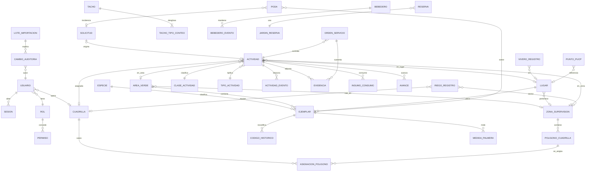

# Mapa de datos y de edición — VerdePUCP

Fecha: 2026-09-25. Contraste entre la web original, `data/raw/` y el esquema `apps/api/migrations/001`–`006`. Los conteos vivos se recalcularon el 2026-09-25 con GET públicos. No se llamó al Apps Script de escritura (`WEB_APP_URL` en `data/raw/legacy-app/script.js`).

Regla de nombres: ningún nombre de persona real se copia a la base. En este documento los responsables se citan por conteo, no por nombre.

## 1. Modelo propuesto

El esquema actual mezcla tres ideas en sitios distintos:

- `zonas` guarda los 534 polígonos de `jefe_de_grupo.json` (`002_catastro.sql`).
- El inventario mete bebederos, tachos, flora y cafetos en una sola tabla sin columnas propias (`004_inventario.sql`).
- La labor apunta al área y a la zona con texto (`actividades.area_feature_id`, `zona_feature_id`).

Propuesta: tablas propias, FK, y la tabla `zonas` actual renombrada en una migración a `poligonos_cuadrilla` sin perder geometría. Las zonas de supervisión Z1–Z4 son otra entidad.

`POLIGONO_CUADRILLA` es el actual `zonas`. `ASIGNACION_POLIGONO.cuadrilla_id` sustituye al campo `jefes` con un identificador ficticio. `CAMBIO_AUDITORIA` guarda antes/después JSON y el id de lote para revertir.

Numeración de migraciones reservada (el último archivo es `006_limpieza.sql`):

| Rango | Frente |
|-------|--------|
| 007–009 | Seguridad, auditoría, FK de lo ya existente |
| 010–019 | Catastro, ejemplar, zonas de supervisión, lugares |
| 020–029 | Labores, catálogo de 45 tipos, monitoreo, poda, vivero |
| 030–039 | Tachos, bebederos, palmeras, puntos, reservas ficticias |
| 040–049 | Importación, evidencias, lotes reversibles |

## 2. Reglas comunes de anonimización

Se aplican al ETL y a cualquier importación.

1. Columnas de persona (`jefes`, `Responsable`, `Personal a cargo`, `reportado por` cuando sea nombre, `Responsables del reporte`): se reemplazan por un nombre ficticio estable. La clave es el hash SHA-256 del nombre normalizado (minúsculas, sin tildes). El mismo hash siempre produce el mismo ficticio, para no romper series. No se guarda el nombre real ni el hash en columnas visibles.
2. Tabla de ficticios de este campus (asignación fija, no aleatoria por corrida): hash que en vivo agrupa 259 polígonos → «Valeria Quispe»; el de 168 → «Mateo Salazar»; el de 104 → «Renato Cárdenas». En monitoreo 2026 los conteos 69, 56 y 48 usan los mismos tres ficticios si el hash coincide con el de jefes; si no, «Nora Beltrán», «Iván Paredes» y «Lucía Mendoza» en ese orden de frecuencia. Implementar la tabla en código del ETL, no en un documento con los nombres reales.
3. Etiquetas que no son personas se conservan: «campo depo», «Bosque húme».
4. Correos, teléfonos y `placeId` de Google no se cargan. De puntos PUCP se guardan título, latitud, longitud y URL pública si hace falta el enlace al mapa; no el teléfono.
5. Fotos: se copia el archivo a S3 o a disco con un id propio. No se guarda el id de Drive ni la URL de Apps Script.
6. Reservas: no hay fuente pública. Se generan 71 filas ficticias (el mock ya tiene 71 en `data/mocks/reservas_agenda.mock.json`) marcadas `origen = ficticio`.
7. Un campo `origen_ref` guarda el id de la fila fuente (`N°`, `PT_b1`, `PO-1`) para poder reimportar sin duplicar. No guarda PII.

## 3. Qué no está en la web

Pedirlo a la universidad. No inventar el dato real.

| Dato | Por qué no se carga desde la web |
|------|----------------------------------|
| Reservas reales | CSV publicado: HTTP 401 el 2026-09-25. Hoja `1R3Xz8…`, gid `1907703639` |
| Salud del ejemplar | RF-04 la pide. La gviz solo tiene «OBSERVACIÓN FEN 2026» |
| Indicadores oficiales y columnas de reporte intermedio/avanzado | El backlog los marca pendientes de validación (HUID 16, 23, 26) |
| SSO, dominio, TLS, cuenta fuera del Learner Lab | No están en el mapa |
| Ortofoto OSG | No está publicada en el visor |
| GPS de barredoras | Rutas fijas en `script.js` (simulación Turf). No hay hoja |
| Asignación real persona–cuadrilla | Existe en la web y se anonimiza. La universidad confirma por otro canal si quiere el dato real |
| JPEG de bebederos si Drive cierra | Índice de 70 claves en `data/raw/appscript/drive_fotos_api.json`; el repo no tiene los JPG |
| RPO, RTO, retención | Acuerdo de operación, no un archivo |

## 4. Entidades

Leyenda de fuente: «vivo» = URL comprobada el 2026-09-25; «local» = archivo del repo. Validaciones comunes: CRS EPSG:4326; latitud entre −12.20 y −11.90; longitud entre −77.30 y −76.90 (el campus). Fuera de ese rango la fila va al reporte de errores, no se descarta en silencio. Textos con `<` o `http` de HTML de KML no se guardan (el ETL de bebederos ya lo evita en `plainPlace`).

Formato de importación común: CSV UTF-8 con cabecera, o GeoJSON FeatureCollection, o xlsx con una hoja nombrada igual que la entidad. Vista previa: primeras 20 filas, conteo de válidas, lista de errores `{fila, campo, motivo}`. El lote queda en `lotes_importacion` y se puede revertir si nadie editó después una fila de ese lote; si la editó, la reversión pide confirmación y no pisa el cambio posterior.

### 4.1 Área verde

Fuente: vivo y local `https://mapa-web-6.vercel.app/areas_verdes.geojson` — 521 MultiPolygon. Tabla actual `areas_verdes`.

| Campo | Tipo | Validación |
|-------|------|------------|
| feature_id | texto | `AV-` + estable; único |
| codigo | texto | opcional; único si viene |
| nombre | texto | opcional; hoy solo 20 informados |
| uso | catálogo | uno de los usos presentes en la fuente, más alta de catálogo |
| proy_riego, riego_act | catálogo | no texto libre nuevo sin alta previa |
| referencia | texto | 500 caracteres |
| perimetro_m, area_m2 | número | ≥ 0; si hay geom, se recalculan con PostGIS y se avisa si difieren más del 5 % |
| geom | MultiPolygon 4326 | NULL permitido (catastro progresivo) |
| zona_supervision_id | FK | calculada por intersección; editable |

Formulario: ficha actual (`panel/Modulos.tsx` `CatastroPanel`) más código, proyecto de riego, perímetro, área y botón «editar geometría» (dibujo MapLibre, vértice a vértice, guardar GeoJSON). Importador: GeoJSON con las propiedades `Nombre`, `código`, `Uso`, `Proy riego`, `Riego act`, `Referenc_1`, `Perimetro`, `Área`. Anonimización: no hay personas.

### 4.2 Zona de supervisión

Fuente: vivo `https://mapa-web-6.vercel.app/supervisoress.geojson` HTTP 200, 4 MultiPolygon, propiedades `id`, `ZONA`, `Area`. `docs/legacy-recovery/INVENTARIO-DATOS.md` decía que no había archivo suelto; el 2026-09-25 sí responde. No está en el ETL (`internal/etl/run.go` no la lista).

| Campo | Tipo | Validación |
|-------|------|------------|
| codigo | texto | `Z1`…`Z4` único |
| nombre | texto | obligatorio |
| area_m2 | número | la fuente trae el área; se verifica con `ST_Area` en metros |
| geom | MultiPolygon | obligatoria en la carga inicial; luego editable |

Formulario: mapa con las cuatro zonas, nombre y código. Importador GeoJSON. Sirve para filtrar tachos, como ya hace el `script.js` original. Anonimización: no hay personas.

### 4.3 Polígono de cuadrilla (hoy «zona»)

Fuente: vivo `jefe_de_grupo.json`, 534 features (505 Polygon + 29 MultiPolygon). Local: el campo `jefes` ya no trae la distribución real. Cargar desde la URL viva y anonimizar en el acto.

| Campo | Tipo | Validación |
|-------|------|------------|
| feature_id | texto | `PC-` único (no reutilizar `Z-` para no chocarlo con Z1–Z4) |
| atributos de área | como 4.1 | mismos campos de jardín |
| geom | MultiPolygon | obligatoria |
| cuadrilla_id | FK | sustituye a `jefes`; ficticio |

Formulario: polígono + selector de cuadrilla (solo ficticios). Importador GeoJSON; columna `jefes` se transforma y no se persiste. Anonimización: sección 2.

### 4.4 Cuadrilla y responsable ficticio

No hay tabla de personas reales. `capataces` hoy tiene tres equipos de demo (`003_operacion.sql`).

| Campo | Tipo | Validación |
|-------|------|------------|
| id | texto | estable |
| nombre_ficticio | texto | de la tabla de la sección 2 |
| turno | catálogo | `manana` o `tarde` |
| activo | bool | baja lógica |

Formulario en Catálogos. No se importa el nombre real. El seed de equipos Norte/Sur/Riego se conserva como cuadrillas de demostración, distintas de las tres ficticias del campus.

### 4.5 Lugar

Fuente: local `data/raw/sheets/lugares.csv`, 76 filas, columnas `lugar`, `latitud`, `longitud`. URL: `URL_LUGARES_CSV` en `script.js` (gid `216669177`). No hay ETL.

| Campo | Tipo | Validación |
|-------|------|------------|
| nombre | texto | único normalizado (sin tildes, minúsculas) |
| lat, lon | número | rango del campus; coma decimal aceptada |
| zona_supervision_id | FK | punto dentro del polígono, si cae |

Formulario: nombre y pin. Importador CSV. Las labores sin coordenada (181 de 283 en monitoreo) se georreferencian por este diccionario, como hace el original.

### 4.6 Especie y ejemplar (flora / árboles)

Fuente viva gviz, hoja `1QQxHKnefZ94Nk2raTwOe0N_zxBlb3AdQC_MP3ZzfRoI`: 1081 filas el 2026-09-25 (la copia local tiene 1050). Columnas: `N°`, `Ubicación`, `Referencia`, `Latitud`, `Longitud`, `Nombre común`, `Nombre científico`, `Tipo de vegetación`, `campus pucp Cantidad`, `Foto`, `Código`, `OBSERVACIÓN FEN 2026`.

| Campo ejemplar | Validación |
|----------------|------------|
| numero_origen | entero único, el `N°` |
| codigo | texto opcional; 635 informados en vivo |
| especie_id | FK; se crea la especie si el científico es nuevo (92 en vivo) |
| nombre_comun | texto |
| tipo_vegetacion | catálogo: Árbol, Palmera, Arbusto, Herbácea, Trepadora, Suculenta |
| cantidad | entero ≥ 1, default 1 |
| ubicacion_lugar_id | FK al lugar por nombre; si no existe, error de preview |
| referencia | texto |
| lat, lon | obligatorios en esta fuente (1081/1081) |
| observacion_fen_2026 | texto |
| foto_id | FK a evidencia o archivo importado; no URL de Drive |
| salud | NULL hasta que la universidad lo entregue |

Formulario de escritorio: todos esos campos, pin arrastrable, miniatura. Importador: CSV con esa cabecera o el JSON gviz ya normalizado a CSV. Duplicado = mismo `numero_origen`. Anonimización: las fotos no llevan nombre de persona; si el nombre de archivo lo trajera, se renombra al id.

Palmeras de `flora.csv` (gid `730733478`): 76 filas en el archivo, 74 con coordenada válida. Dos se rechazan y se listan: latitud −1.2067880 y longitud −7.708083 (coma decimal mal puesta). No se «arreglan» a mano en el ETL. Campos extra respecto del ejemplar: UTM norte, UTM este, altura, altura de fuste, DAP, radio, zunchado. Van a `medida_palmera` (1:1 con ejemplar). El checkbox de palmeras no está en el HTML original; igual se cargan.

Cafetos (`cafetos.csv`, gid `746966399`): 53 puntos válidos en el ETL actual. El resto de filas numeradas no trae longitud en rango (hay −7.70). Mismo reporte de errores. Si el cafeto ya existe como ejemplar por coordenada y nombre, se vincula; si no, es ejemplar `tipo=cafeto`.

### 4.7 Catálogo de actividades

Fuente local: `data/raw/sheets/actividades.csv` (gid `344271829`). 45 tipos, 7 clases operativas contadas el 2026-09-25:

| Clase | Tipos |
|-------|------:|
| Habilitación de jardines | 6 |
| Rehabilitación y rediseño de jardines | 7 |
| Mantenimiento de jardines | 10 |
| Poda | 4 |
| Propagación y plantación | 10 |
| Riego | 4 |
| Manejo de residuos vegetales | 4 |

El bloque derecho del mismo CSV describe clases y un rol genérico (`jardineros`, etc.). Ese rol no es una persona. No se importa como usuario.

| Campo | Validación |
|-------|------------|
| clase | texto único |
| tipo | único dentro de la clase |
| descripcion | texto |
| activo | bool |

Formulario: el de catálogos (`CatalogosPanel`) ampliado a clase + tipo + descripción, no solo código y nombre. Importador CSV de dos columnas (clase, tipo) más descripción. Sustituye los 5 `tipo_actividad` semilla sin borrar labores ya creadas: se mapean riego→Riego, poda→Poda, limpieza→Mantenimiento, incidencia→Inspección, inspeccion→Inspección, y se deja constancia en auditoría.

### 4.8 Labor (monitoreo 2026 y altas nuevas)

Fuente viva gid `530107837`, misma que `monitoreo_base.csv`: 283 filas. Columnas: `Clase`, `Estado`, `Fecha de solicitud`, `fecha_atención`, `Mes`, `lugar`, `latitud`, `longitud`, `Actividad`, `comentario`, `Foto`, `Responsable`, `Detalle`. 102 con coordenadas, 219 con foto, 52 estado Cerrado, 110 sin responsable, tres responsables (69, 56, 48).

La tabla `actividades` se extiende; no se crea un segundo «monitoreo».

| Campo formulario / CSV | Validación |
|------------------------|------------|
| clase_id, tipo_id | FK al catálogo; si el tipo no está, error (el original saltaba la fila; aquí se muestra) |
| estado | catálogo. Vacío en 231 filas: importar como `sin_estado` y no inventar «pendiente» |
| fecha_solicitud, fecha_atencion | `DD/MM/AAAA` o ISO; fecha de atención ≥ solicitud si ambas vienen |
| lugar_id | FK; obligatorio si no hay coordenada |
| lat, lon | opcionales si hay lugar |
| comentario, detalle | texto |
| cuadrilla_id | FK ficticia; vacío permitido (110 filas) |
| foto | archivo o URL pública de solo lectura, descargada al almacén propio |
| ejecutor | `propia` por defecto en esta hoja |

`geom` pasa a ser NULL si hay `lugar_id` o `zona_supervision_id` (DP2: registrar sin GPS). Importador CSV. Reversible por lote.

### 4.9 Poda

Fuente local `data/raw/sheets/poda.csv` (gid `1845362857`): 25 registros bajo la fila de cabecera. Columnas de la fila 2: ID, ID Incidencia, Tipo, reportado por, fechas de reporte y ejecución, personal, ubicación, unidad, cantidad pedida, cantidad ejecutada, tipo de actividad, tipo de vegetación, nombre común, nombre científico, foto, comentario, prioridad, link de ficha.

| Campo | Validación |
|-------|------------|
| codigo | `PO-n` único |
| codigo_externo | `OSG-…` si viene; no se genera |
| tipo, tipo_actividad | FK si existe en el catálogo; si no, error de preview |
| fechas | como las labores |
| personal | ficticio |
| ubicacion | FK lugar o texto de campus ya conocido, con aviso si no hay match |
| unidad | texto corto |
| cantidad_pedida, cantidad_ejecutada | número ≥ 0 |
| especie | FK |
| prioridad | catálogo baja/media/alta |
| foto, ficha | archivo propio; el link de Drive solo se usa para copiar |

Formulario propio, enlazado a solicitud si hay código OSG. Importador CSV empezando en la fila de cabecera real (la primera fila del archivo es un rótulo, no la cabecera).

### 4.10 Vivero

Fuente viva: publicado `2PACX-1vRrEaa…` gid `1814328638`. El 2026-09-25: 689 filas no vacías (la copia local tiene 683). Columnas: `Fecha`, `Área`, `Subproceso`, `Etapa`, `Descripción`, `Responsables del reporte`, `Observaciones`, `Lugar`. Áreas en la copia local: Fauna 335, Flora 299, vacío 34, Otros 9, Ambiental 3, otros 3. Subprocesos con valor: 29. Lugares con valor: 52.

| Campo | Validación |
|-------|------------|
| fecha | opcional |
| area | catálogo (Fauna, Flora, Ambiental, Otros) |
| subproceso, etapa | texto del catálogo que se da de alta al importar, no libre después |
| descripcion, observaciones | texto |
| responsables | ficticios, lista separada por coma |
| lugar_id | FK si el nombre calza; si no, queda texto `lugar_libre` y sale en el reporte |

Formulario con filtro por mes, como el original. Importador CSV. Marcador en el mapa por lugar, no por fila.

### 4.11 Tacho

Fuente local `data/raw/sheets/tachos.csv` (gid `657037007`): 185 filas de datos, 184 con latitud. El ETL solo guarda id, lugar y nota (`readTachos`).

Conteos a persistir, sumados en la copia local: No aprovechables 294, Papel y cartón 142, Plástico 260, Vidrio 242, Pilas 56, Peligrosos 0, RAEE 12, Metales 2, Aniquem 38, Intermedios plástico 26, Intermedios metal 4.

| Campo | Validación |
|-------|------------|
| codigo | `PT_…` único |
| lat, lon | obligatorios para el punto; la fila sin coordenada se lista |
| nota, lugar, espacios | texto |
| accion, tacho_actual, tacho_nuevo, recomendaciones | texto |
| conteos | 11 enteros ≥ 0, columnas propias |
| foto | archivo propio |
| zona_supervision_id | punto dentro de Z1–Z4 |

Formulario: pin, los 11 conteos y la recomendación. Importador CSV con esa cabecera. `subtipo` deja de ir vacío.

### 4.12 Bebedero

Fuente: cinco GeoJSON locales, 40+10+8+7+2 = 67. El subtipo ya se carga. Se pierden estado y sede.

| Campo | Validación |
|-------|------------|
| codigo | `Name` único (`PT_bb…`) |
| subtipo | fuente, llenador, nuevo, deterioro, baja |
| estado | el del archivo de origen, no solo el nombre del archivo |
| sede | columna KML de sede, texto |
| lat, lon | Point |
| foto_id | match contra el índice de 70 códigos si el JPEG se recupera en lectura |

Formulario: punto, subtipo, estado, sede, foto. Importador GeoJSON por archivo, más una columna `estado` explícita. Anonimización: el HTML `descriptio` no se guarda.

### 4.13 Fauna, puertas, playas, vereda, xerofítica, jardín de reserva

Ya cargados. Pasar a tablas o, como mínimo, a columnas en vez de `detalle` libre, y hacerlos editables.

| Entidad | N | Campos editables | Fuente |
|---------|--:|------------------|--------|
| Fauna | 19 | nombre del animal, geom | `fauna.geojson` |
| Puerta | 7 | código, geom; nombre vacío hasta que lo entreguen | `puertas_entradas.geojson` |
| Playa | 15 | código, geom | `playas_de_estacionamiento.geojson` |
| Vereda en riesgo | 1 | geom, nota | `area_vereda_peligro.geojson` |
| Xerofítica | 10 | clase, riego, área, perímetro, geom | `xerofitica.geojson` |
| Jardín de reserva | 21 | campos de área + `pertenecen` (DAF 15, Unidades 6 en la auditoría) | `jardines_reserva.geojson` |

Formularios de geometría iguales al de áreas. Importador GeoJSON por capa.

### 4.14 Reserva de jardín (ficticia)

No hay CSV público. Se parte de `data/mocks/reservas_agenda.mock.json` (71 reservas, 21 polígonos) y se etiqueta `ficticio`.

| Campo | Validación |
|-------|------------|
| jardin_id | FK al jardín de reserva |
| fecha | ISO |
| hora_inicio, hora_fin | hora, fin > inicio |
| estado | catálogo: reservado, realizado, cancelado |
| evento | texto ficticio, sin nombres reales |
| unidad | texto de unidad organizativa, no persona |

Formulario de calendario por mes, semana y día (filtros del original). Importador CSV con esas columnas, rechazado si `origen` no dice `ficticio` mientras la hoja siga en 401. Cuando la universidad entregue el archivo, se reemplaza el lote ficticio entero.

### 4.15 Punto PUCP

Fuente local `data/raw/sheets/puntos_pucp.csv` (gid `1330096436`): 153 filas. Cabecera: lat, lng, phone, phoneUnformatted, placeId, searchPageUrl, searchString, title, url, website, image.

Se guardan `titulo`, `lat`, `lon`. No se guardan teléfono, placeId ni website. La imagen no se descarga si es un recurso de Google con sesión. `edificios_pando.geojson` sigue siendo la huella OSM, otra capa.

Formulario: título y pin. Buscador en el mapa. Importador CSV con descarte explícito de columnas de contacto en el reporte («columnas omitidas por datos personales»).

### 4.16 Evidencia de campo

Flujo para el operario con el teléfono, sin cuenta obligatoria en el MVP (la propuesta lo dice). Quien sube es el capataz autenticado; el operario figura como participante en `personal_labor` (nombre ficticio o «operario de cuadrilla»).

1. En el móvil, la foto se toma o se elige. Antes de salir del teléfono: lado largo a 1600 px, JPEG calidad 0.7, tope 1.5 MB. Si sigue por encima de 8 MB, se rechaza en cliente y en API (`SubirEvidencia` ya corta a 8 MB).
2. Se lee la geolocalización del EXIF si existe; si el usuario niega el permiso, la evidencia se guarda sin punto y se muestra «sin ubicación». No se bloquea la labor.
3. Sin red: el archivo y el metadato van a IndexedDB (nuevo almacén `cola-evidencias`, al lado de `apps/web/src/offline/queue.ts`). La UI dice «guardado en este equipo» solo después del `put`. UUID propio, distinto del de la labor.
4. Con red: `POST /api/v1/evidencias` multipart. El API valida MIME real (no solo el header), tamaño y que la labor sea de la cuadrilla del capataz.
5. Almacén: S3 privado si `EVIDENCIAS_BUCKET` está definido (`internal/blobs/s3.go`); si no, disco `EVIDENCIAS_DIR`. Postgres guarda la clave, no el binario. Descarga solo con sesión y permiso `consultar`.
6. Al confirmar, se escribe un `actividad_eventos.tipo = evidencia`.
7. No se reintenta un UUID ya confirmado. Si el mismo UUID llega con otro hash de archivo, 409.

Permisos: capataz registra en sus labores; coordinación y admin registran en cualquiera; jefatura consulta. El cubo bloquea acceso público (el Terraform ya lo hace si `create_evidence_bucket` es true).

### 4.17 Auditoría y reversión

Tabla `cambios` (migración 007): `id`, `entidad`, `entidad_id`, `accion` (alta, edicion, baja, importacion, reversion), `antes` jsonb, `despues` jsonb, `usuario_id` FK, `lote_id` nullable, `created_at`.

Revertir un lote: se aplican los `antes` en orden inverso dentro de una transacción. Si una fila tiene un cambio posterior de otro usuario, esa fila se excluye y aparece en el reporte. No hay borrado físico de áreas ni de labores (RF-34).

### 4.18 Lo que ya es editable y se conserva

| Pieza | Rutas | Límite actual a ampliar |
|-------|-------|-------------------------|
| Sesión | `/api/v1/sesion` | ver auditoría de seguridad |
| Catálogo | `/api/v1/catalogos` | sin edición de nombre; sin las clases nuevas |
| Ficha de área | `/api/v1/catastro/areas` | sin geometría ni código |
| Labor | `/api/v1/operacion/actividades` | sin los campos de la hoja 2026 |
| Solicitud, orden, riego | `/api/v1/solicitudes`, `/ordenes`, `/riego` | sin edición ni baja |
| Evidencia | `/api/v1/evidencias` | sin offline ni EXIF |
| Reporte | `/api/v1/reportes/labores` | solo básico |

Cada entidad de las secciones 4.1 a 4.15 gana listado, alta, edición, baja lógica y export CSV en el mismo módulo de escritorio. El mapa sigue siendo la entrada (`CampusMap.tsx`).
