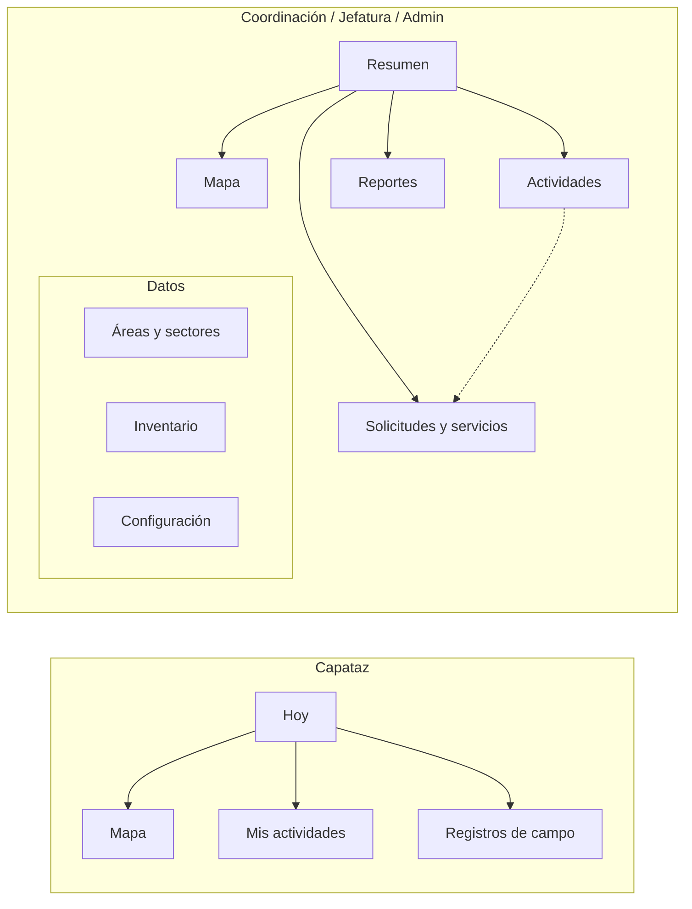

# Propuesta de claridad de la interfaz — VerdePUCP

Fecha: 27/09/2026. Rama de análisis: `docs/fase1-arquitectura-backlog` (base `v1-propuesta-referencia`, 115a56d).
Alcance: **solo análisis y propuesta**. No se tocó código.

Fuentes revisadas:

- Código: `apps/web/src/App.tsx`, `apps/web/src/panel/*.tsx`, `apps/web/src/ui/*`, `apps/web/src/styles.css`, `apps/web/src/map/CampusMap.tsx`, `apps/web/src/producto.ts`, `apps/web/src/inventario.ts`.
- Permisos del servidor: `apps/api/internal/accesos/accesos.go` (matriz semilla) y los `exige(c, "…")` de `apps/api/internal/handlers/*.go`.
- Capturas: `fase1-*.png` (carpeta local de capturas del equipo, no versionada) (1280×800 y 390×844, stack local de hoy, sesión `admin`), además de `live-*`, `v1review-*` y `loteA-*` (menú «Más», ficha de labor).
- Backlog v2 (`docs/fuente/extraccion/backlog_v2.txt`): RF-02, RF-03, RF-12, RF-29 a RF-32, RNF-01, RNF-02, RNF-06.
- Documentos anteriores: `docs/UI-AUDIT.md` (sistema visual, tokens, jerarquía) y `docs/PLAN-PRODUCTO-Y-UI.md` (riel de guardia, olas). `docs/AUDITORIA-UI-SCROLL.md` resolvió el scroll, la hoja móvil y el movimiento. Esta propuesta **no** reabre tokens, tipografía ni el comportamiento de la hoja: los da por buenos.

---

## 0. En una frase

La interfaz tiene casi todas las funciones, pero está organizada **según cómo se construyó** (un módulo por tabla o por frente de trabajo) y no **según lo que cada persona hace en su turno**. Todos los roles entran al mismo mapa con el mismo panel de capas. Nueve pestañas usan jerga de base de datos. Los formularios de Riego, Poda y Vivero están escondidos bajo «Labores». Además, la UI ofrece acciones que el servidor luego rechaza con 403.

### Los 5 cambios principales

| # | Cambio | Por qué primero |
|---|---|---|
| **1** | **Pantalla de inicio por rol («Hoy» para el capataz, «Resumen» para oficina)**, que reemplaza al panel de capas como entrada. | Hoy nadie sabe qué hacer al entrar: la primera vista es una lista de casillas de capas (`fase1-desktop-mapa.png`). RF-32 y RNF-06 piden foco en lo propio y pocos pasos. |
| **2** | **Navegación por rol derivada de permisos reales** (no de la lista fija `modulosDe`), con nombres de tarea: *Actividades*, *Registros de campo*, *Áreas y zonas*, *Configuración*. | `modulosDe()` (`App.tsx:55`) muestra formularios a roles sin permiso. Jefatura ve Poda, Vivero, Riego, Inventario y la edición de Catastro, y el servidor responde `403 su rol no tiene ese permiso`. |
| **3** | **Sacar Riego, Poda y Vivero de «Labores»** a su propia sección (*Registros de campo*) con subpestañas y el formulario cerrado hasta pedirlo. | `App.tsx:829-831` apila tres paneles con formularios abiertos (Poda tiene 15 campos) debajo de la lista de labores. Quien baja por la lista termina en «Guardar registro» del vivero (`fase1-desktop-labores-bottom.png`). |
| **4** | **El mapa como vista principal limpia**: capas y leyenda en un control flotante sobre el mapa, y popup de actividad con acciones («Ver detalle», «Cambiar estado»). El panel lateral queda para la lista y el detalle. | RF-29 pide resumen y acceso al detalle «sin abandonar el mapa». Hoy tocar un pin cambia de módulo (`App.tsx:859-864`) y la leyenda color/letra solo existe como frase en Labores. |
| **5** | **Vacíos y botones deshabilitados que explican el siguiente paso**, más ayuda contextual mínima (tooltips en términos de dominio y un recorrido de 3 pasos por rol). | «Confirmar escritura» y «Revertir lote» aparecen deshabilitados sin motivo (`fase1-desktop-importar.png`). Catastro deja media pantalla con «Elija un área» (`fase1-desktop-catastro.png`). No hay un solo `title` ni tooltip de ayuda en `apps/web/src` (solo `Importaciones.tsx:141`, para celdas truncadas). |

---

## 1. Diagnóstico

Cada hallazgo indica la **evidencia** (captura y componente) y el **efecto** en quien usa la app.

### 1.1 Etiquetas de navegación

| # | Hallazgo | Evidencia | Efecto |
|---|---|---|---|
| E1 | Las pestañas nombran **tablas o frentes técnicos**, no tareas: «Catastro», «Inventario», «Catálogos», «Importar», «Admin». | `MODULOS` en `App.tsx:43-53`; riel en `fase1-desktop-*.png`. | El capataz no sabe si «Catastro» es para él. La API no permite a jefatura editar Catastro, pero la pestaña está ahí. |
| E2 | **«Labores» contiene cuatro cosas**: labores, riego, poda y vivero. | `App.tsx:752-833`; `fase1-desktop-labores-bottom.png` termina en el formulario de vivero («Flora», «Subproceso», «Etapa»). | Riego, Poda y Vivero no aparecen en la navegación. Hay que adivinar que están al fondo de Labores. |
| E3 | **Vocabulario inconsistente** para lo mismo: *zonas* (534 polígonos de sector), *zonas de supervisión* (Z1–Z4), *sector operativo*, *sector* (texto libre en Riego), *cuadrilla*, *equipo* y *capataz*. | Resumen `App.tsx:422` («534 zonas»); leyenda `App.tsx:689` («Sector operativo»); `CatastroEditor.tsx:464` («zona de supervisión»); `RiegoPanel` (`Modulos.tsx`, campos «Zona de supervisión» y «Sector»); Reportes («Cuadrilla»); Labores («Equipo»). | No se entiende si «Z1», «Sector operativo» y «Equipo Norte» son lo mismo. El backlog v2 usa *sector de capataz* (RF-06, RF-34). |
| E4 | «Labores» frente a «actividades»: el backlog v2 (RF-29 a RF-32) y la API (`/api/v1/operacion/actividades`) dicen *actividades*; la UI dice *labores*. | `Labores.tsx:91`; `operacion.go:58-64`. | Doble vocabulario entre documentación, reportes y pantalla. |
| E5 | Etiquetas cortas o en inglés técnico: «Admin», «Importar», «Plano/Relieve» en la barra global aunque solo afectan al mapa. | `App.tsx:52`, `App.tsx:600-603`. | «Relieve» en la barra superior de un formulario de catálogo no tiene sentido. |
| E6 | La barra superior muestra el **nombre** («Administración», «Equipo Norte») pero no el **rol**. En el teléfono ni siquiera el nombre (`.session span { display:none }`, `styles.css:654`). | `fase1-desktop-*.png` (arriba a la derecha «Administración»); `fase1-mobile-mapa.png`. | En campo no se confirma con qué cuenta se entró. Crítico si un equipo comparte el teléfono. |

### 1.2 Agrupación de pestañas

| # | Hallazgo | Evidencia | Efecto |
|---|---|---|---|
| G1 | **Nueve pestañas planas** para admin y ocho para coordinación, sin grupos. En el teléfono, cinco quedan en «Más» sin agrupar. | `modulosDe` `App.tsx:55-60`; `repartirModulos` `ui/navegacion.ts:2`; `loteA-mas-menu.png`. | «Solicitudes» y «Reportes», que coordinación usa a diario, quedan escondidas en «Más» junto a «Admin». |
| G2 | **Reservas aparece dos veces**: al final del panel Mapa (`<CalendarioReservas />`, `App.tsx:749`) y como subpestaña de Inventario (`InventarioCapas.tsx:256`). | `fase1-desktop-mapa-bottom.png`; `fase1-desktop-inventario.png`. | Dos caminos distintos para lo mismo. Además, la agenda se mezcla con capas del mapa (ya lo señalaba `UI-AUDIT.md`, «Mapa, plano»). |
| G3 | Inventario **mezcla dos listas en una**: subpestañas Tachos/Bebederos/Puntos/Reservas y, debajo, una lista de *capas* (Fauna, Puertas, Playas…) con la línea «Campos: nombre». Los registros reales vienen después. | `InventarioCapas.tsx:256-279`; `fase1-desktop-inventario.png`. | Con «Tachos» seleccionado, la lista enseña «Fauna · Campos: nombre». No queda claro qué está seleccionado ni qué se edita. |
| G4 | **Solicitudes y órdenes de servicio** están en «Solicitudes», pero crear una orden exige elegir una labor en otra pestaña («Ninguna labor seleccionada.»). | `Modulos.tsx:359-407`; `App.tsx:836`. | Un flujo de dos pestañas sin guía. Ya lo apuntaba `UI-AUDIT.md` («Solicitudes y órdenes»). |
| G5 | Importar tiene **19 entidades en un solo `<select>`**, de «Áreas verdes» a «Xerofítica», sin agrupar. | `panel/importaciones.ts:1-20`. | Hay que saber de antemano el nombre interno de la entidad. |
| G6 | El **historial de cambios** que exige la regla «toda entidad editable con historial» existe en la API (`GET /api/v1/auditoria/cambios`, `auditoria.go:39`) pero **no hay pantalla** que lo use (búsqueda en `apps/web/src`: sin referencias). Tampoco se listan lotes anteriores: «Revertir lote» solo sirve para el lote de la sesión actual (`Importaciones.tsx:167`). | `grep auditoria/ apps/web/src` → solo `importaciones.ts:61` (revertir). | La trazabilidad no se ve fuera de la bitácora de cada labor. |

### 1.3 Ubicación de las acciones

| # | Hallazgo | Evidencia | Efecto |
|---|---|---|---|
| A1 | **La UI ofrece acciones que el servidor niega.** Jefatura tiene `consultar, validar, reportes, solicitudes` (`accesos.go:44`) y no `registrar`. Aun así ve y puede enviar: edición de áreas (`Fichas.Patch` exige `registrar`, `producto.go:297`), inventario (`frente2b.go`, `registrar`), riego (`CrearRiego`, `producto.go:476`), orden de servicio (`CrearOrden`, `producto.go:427`), poda y vivero (`poda.go:62,134`). | `modulosDe("jefatura")` `App.tsx:57`; `RiegoPanel/PodaPanel/ViveroPanel` sin condición de rol en `App.tsx:829-831`. | Se llena un formulario de 15 campos y al guardar aparece «No se pudo guardar la poda.» (`Poda.tsx:86`). El 403 ni siquiera se traduce. |
| A2 | Al revés, el **capataz tiene `registrar`** y por eso la API le permite editar el catastro y el inventario. La UI le muestra el editor completo de Catastro («Nueva área», dibujar polígono, dar de baja) y de Inventario. | `modulosDe("capataz")` `App.tsx:56`; `accesos.go:42`. | Contradice RNF-06 («interfaz simple de campo») y aumenta el riesgo de ediciones accidentales en campo. Es una decisión de producto, no un bug: aquí se propone ocultarlo en la UI del capataz y **validar con el cliente** si la matriz debe cambiar. |
| A3 | El **detalle de una labor tiene cuatro botones de guardar** con alcances distintos: «Guardar ficha» (fieldset), «Guardar estado», «Reasignar» y «Archivar/Confirmar archivo». Encima aparece la «Ficha de la labor» con fechas vacías antes del estado. | `Labores.tsx:234-311` y `FichaLabor` `Labores.tsx:317-388`; `loteA-labor-ficha.png`. | La acción más frecuente en campo (cambiar estado) queda debajo de un formulario administrativo. |
| A4 | **«Marcar labor»** es la acción primaria de Labores, pero el verbo no dice «crear» y el formulario de alta aparece *entre* los filtros y la lista. | `Labores.tsx:131-199`; `fase1-desktop-labores.png`. | Quien busca «Nueva actividad» no la encuentra. Al elegir una labor, el alta queda fuera de vista (ya señalado en `UI-AUDIT.md`). |
| A5 | Tocar un pin del mapa **cambia de módulo** a Labores y abre el panel (`App.tsx:859-864`). En el teléfono, la hoja sube al 55 % y tapa el pin. | `onSelectActividad`; `BottomSheet.tsx` (`MEDIA = 0.55`). | RF-29 pide «resumen al seleccionar un marcador, con acceso al detalle, sin abandonar el mapa». |
| A6 | Elegir un **polígono del catastro** en el mapa solo añade texto a la línea de estado (`picked`, `App.tsx:661` y `858`). No hay enlace a su ficha. | `onSelectCatastro`. | No se puede ir del mapa a editar el área que se ve. |
| A7 | Catastro llama a rutas que **no existen** en la API: `PATCH /catastro/zonas-supervision/:codigo`, `POST /catastro/areas/:id/baja` y `POST /catastro/zonas-supervision/:codigo/baja` (`panel/catastro.ts:287-315`). Solo están registradas `GET/POST /zonas-supervision` (`handlers/catastro.go:25-26`) y `GET/POST/PATCH /catastro/areas` (`producto.go:90-92`). | `grep` en `apps/api/internal` y `openapi.yaml`: sin coincidencias. | «Dar de baja» y «Guardar zona» (edición) terminan en «La API respondió 404». No es de claridad, pero el usuario lo vive como una UI confusa. Se anota aquí porque cualquier rediseño debe ocultar o desactivar estas acciones hasta que exista la ruta. |

### 1.4 Estados vacíos

| # | Hallazgo | Evidencia |
|---|---|---|
| V1 | Catastro reserva **media altura** a «Elija un área. La ficha queda en este panel.», sin acción. | `CatastroEditor.tsx:463`; `fase1-desktop-catastro.png`, `-bottom.png`. |
| V2 | Importar: «Confirmar escritura» y «Revertir lote» **deshabilitados sin explicación**. | `Importaciones.tsx:164-169`; `fase1-desktop-importar.png`. |
| V3 | Reportes **abre con lo que no existe**: tres métricas «definición pendiente» antes de los filtros y del dato. | `Modulos.tsx:453` (`HUECOS`, `producto.ts:95-114`); `fase1-desktop-reportes.png`. |
| V4 | «No hay labores con este filtro.» no dice **qué filtro** ni ofrece «Quitar filtros». | `Labores.tsx:215`. |
| V5 | Evidencias: «La foto se adjunta cuando la labor ya está en el servidor.» es correcto, pero no dice qué hacer (esperar la sincronización o reintentar). | `EvidenciasCampo.tsx:308`. |
| V6 | Vacíos que sí funcionan y se conservan como patrón: «Todavía no hay órdenes. Una labor tercerizada no se cierra hasta que exista una.» (`Modulos.tsx:364`) y «Ningún área coincide. Puede registrar una sin geometría.» (`CatastroEditor.tsx:400`). | — |

### 1.5 Falta de inicio por rol

- Todas las sesiones entran a `modulo = "mapa"` (`App.tsx:103`) con el panel de **capas** abierto en escritorio (`railOpen` true, `App.tsx:121`). La primera información es «Edificios OSM · Huellas del recinto, solo en relieve» (`fase1-desktop-mapa.png`).
- La línea fija de la hoja dice «521 áreas · 534 zonas · 6 labores» en **todos** los módulos y para todos los roles (`summary`, `App.tsx:418-423`). Son conteos del inventario, no del trabajo.
- Para el capataz no hay «mis pendientes de hoy», ni un contador de cola offline fuera de Labores (`Labores.tsx:200-207`), aunque RNF-01 pide un «indicador visible de pendientes de sincronización».
- RF-32 pide que el capataz alterne **mapa / lista** y que sin conexión degrade a lista. Hoy la lista existe solo dentro del panel de Labores, bajo los filtros.

### 1.6 Densidad y jerarquía visual

- **Formularios de todos los campos siempre abiertos.** Poda muestra 15 campos (`Poda.tsx:99-162`), Vivero 9, Riego 5 e Inventario los conteos de tacho con nombres de columna crudos (`no_aprovechables`, `intermedios_metal`, en `fase1-desktop-inventario.png` y `fase1-mobile-inventario-bottom.png`; origen `inventarioCapas.ts:13`).
- **Doble logotipo** en escritorio: la marca en la barra y el isotipo en el riel (`App.tsx:593` y `610`, `fase1-desktop-*.png`). Ocupa la zona de más valor del riel.
- **Tres niveles de «título»** con el mismo peso visual en un solo scroll: «Labores» (h2), «Riego» (h2), «Poda» (h2) y «Vivero» (h2) son hermanos dentro del mismo panel (`App.tsx:754-831`).
- Los **avisos, pistas y errores** comparten `.hint`/`.status`. En el alta de labor, «Regla local, en proceso. No sale de este equipo. Confirme el tipo antes de guardar.» (`Labores.tsx:162`) es una nota técnica de la IA que el usuario no necesita leer siempre.
- Checkboxes de estado sin contador («Pendiente · En proceso · Bloqueada») mientras la leyenda del catastro sí los tiene: el patrón es incoherente.

### 1.7 Móvil frente a escritorio

- En el teléfono, la barra inferior muestra **Mapa, Labores, Catastro, Inventario, Más** para admin (`fase1-mobile-*.png`). Para el capataz serían los mismos cuatro sin «Más». Catastro e Inventario son editores de oficina y ocupan dos de las cuatro casillas que el capataz tiene al alcance del pulgar.
- El panel de Labores en el teléfono enseña los filtros de oficina («Equipo: Todos los equipos», `fase1-mobile-labores.png`). Para el capataz ese selector no se ve (`puedeAsignar`), pero los checkboxes de estado y el `select` de tipo sí, antes de su lista.
- El nombre de la sesión se oculta en el teléfono (E6).
- En el teléfono, «Plano/Relieve» ocupa el centro de la barra superior. En campo casi no se usa; el control que sí importa (conexión y cola) no existe.
- Lo que ya funciona bien y se conserva: la hoja con asa y anclajes, la barra inferior sin scroll horizontal y los objetivos de 44–48 px (`AUDITORIA-UI-SCROLL.md`, lotes A–D).

### 1.8 Ayuda contextual

- Cero tooltips de dominio. Términos como *tercerizada*, *orden de servicio*, *zona de supervisión*, *lote*, *baja lógica*, *código externo (OSG/Centuria)* y *sin geometría* aparecen sin explicación.
- La leyenda del mapa (color = estado, letra = tipo) es solo una frase en Labores (`Labores.tsx:92`). En Mapa, que es donde se ven los pines, no existe.
- No hay un primer recorrido por rol ni una página de «¿Qué hago aquí?».
- Hay frases de ayuda valiosas, pero **escritas para el equipo de desarrollo**: «GeoJSON de prueba. Guardar arma el payload y no escribe en la base.» (`CatastroEditor.tsx:391`), «Agenda ficticia. La hoja institucional responde 401 y no se abre.» (`InventarioCapas.tsx:387`), «La copia local trae 683 filas; la hoja viva del 2026-09-25 trae 689.» (`App.tsx:831`, prop `delta` de Vivero). Deberían ir a un aviso de «datos de demostración» o al registro de desarrollo, no al texto de trabajo.

---

## 2. Nueva arquitectura de información y navegación

### 2.1 Principios

1. **Inicio por rol**: cada rol entra a una pantalla con *su* trabajo, no al inventario de capas.
2. **Pestañas = tareas**, con el vocabulario del backlog v2: *actividad*, *sector de capataz*, *registro de campo*, *solicitud*, *servicio tercerizado*.
3. **Se ve lo que se puede hacer.** La navegación y los botones se derivan de los permisos de la sesión (`consultar`, `registrar`, `validar`, `reportes`, `catalogos`, `solicitudes`). Lo que es solo lectura se muestra como lectura: campos sin borde y sin botón «Guardar».
4. **El mapa es la vista principal de supervisión (RF-29)**: capas y leyenda van sobre el mapa. El panel es para lista y detalle.
5. **Una acción primaria por pantalla**, fija al pie en el teléfono. Las secundarias van en un menú «⋯».

> Dependencia de API (no se implementa aquí): hoy `GET /api/v1/sesion` devuelve solo `usuario` (`producto.ts:180-186`) y la matriz está en `accesos.Matriz`. Para el principio 3, la sesión debería incluir `permisos: string[]`. Mientras no exista, la UI puede replicar la matriz de `accesos.go:41-46`, aunque eso duplica una regla que RNF-05 pide parametrizable.

### 2.2 Pestañas renombradas (antiguo → nuevo)

| Antiguo (`App.tsx:43-53`) | Nuevo | Contenido |
|---|---|---|
| *(no existe)* | **Hoy** (capataz) / **Resumen** (oficina) | Pantalla de inicio por rol (§2.4). |
| Mapa | **Mapa** | Mapa limpio. Capas, leyenda y colorear por uso/sector en un control flotante «Capas». Sin agenda de reservas. |
| Labores (parte superior) | **Actividades** (oficina) / **Mis actividades** (capataz) | Lista + detalle + alta desde el mapa. Filtros RF-32. |
| Labores (Riego, Poda, Vivero al fondo) | **Registros de campo** → subpestañas *Riego · Poda · Vivero* | Lista por defecto y formulario tras «Nuevo registro». |
| Catastro | **Áreas y sectores** → *Áreas verdes · Sectores de capataz · Reservas de jardín* | Editor actual, más Reservas movidas desde Inventario y Mapa. |
| Inventario | **Inventario** → *Tachos · Bebederos · Puntos PUCP · Otras capas* | Una sola lista: la del tipo elegido. «Otras capas» agrupa Fauna, Puertas, Playas, Vereda en riesgo y demás. |
| Solicitudes | **Solicitudes y servicios** → *Solicitudes · Servicios tercerizados* | «Órdenes de servicio» pasa a llamarse «Servicios tercerizados» (RF-13). |
| Reportes | **Reportes** | Filtros y datos primero; «Indicadores pendientes de definición» al final, plegado. |
| Importar | **Configuración › Importar datos** | Entidades agrupadas (§3.3) y lista de lotes anteriores. |
| Catálogos | **Configuración › Catálogos** | Sin cambio funcional. |
| Admin | **Configuración › Usuarios y permisos** | — |
| *(no existe)* | **Configuración › Historial de cambios** | Usa `GET /api/v1/auditoria/cambios` (`auditoria.go:39`), que ya existe. |

Glosario único (se aplica a etiquetas, reportes y ayuda):

| Término en pantalla | Significa | Reemplaza |
|---|---|---|
| **Actividad** | Intervención con ubicación, tipo y estado (`/operacion/actividades`). | «labor» (se admite como sinónimo en la ayuda) |
| **Sector de capataz** | Polígono de responsabilidad de un equipo (RF-06, RF-34). | «zonas» (534), «sector operativo», «cuadrilla» (como zona) |
| **Zona de supervisión** | Z1–Z4, agrupación de oficina. Solo se muestra donde se usa (Riego, Reportes). | «zona» a secas |
| **Equipo** | Cuadrilla de un capataz (Equipo Norte, Sur, Riego). | «capataz» como filtro, «cuadrilla» |
| **Área verde** | Polígono del catastro (521). | «área», «catastro» |

> Si «zonas» (534 polígonos de sector, `LAYERS.zonas`) y «sectores de capataz» no son lo mismo en el modelo, hay que **decidirlo con el cliente** antes de renombrar. Desde el código no se puede determinar: la capa `zonas` se describe como «Sectores operativos, sin nombres de personas» (`types.ts`), y el backlog habla de «polígonos de sectores del cliente» pendientes de recibir (RF-33, RF-34).

### 2.3 Navegación por rol

Permisos de la semilla (`accesos.go:41-46`): capataz `consultar, registrar`; coordinación `consultar, registrar, validar, solicitudes, reportes`; jefatura `consultar, validar, reportes, solicitudes`; admin, todos.

| Rol | Pestañas visibles (en orden) | Barra móvil (4 + Más) | Solo lectura en… | Oculto respecto de hoy |
|---|---|---|---|---|
| **Capataz de campo** | 1 Hoy · 2 Mapa · 3 Mis actividades · 4 Registros de campo | Hoy · Mapa · Mis actividades · Registros *(sin «Más»)* | — | Catastro e Inventario (el editor completo). Consulta de un área: desde el popup del mapa, en solo lectura. |
| **Ingeniería / Coordinación** | 1 Resumen · 2 Mapa · 3 Actividades · 4 Solicitudes y servicios · 5 Registros de campo · 6 Áreas y sectores · 7 Inventario · 8 Reportes · 9 Configuración (Importar datos, Catálogos en lectura, Historial) | Resumen · Mapa · Actividades · Solicitudes · **Más** (Registros, Áreas, Inventario, Reportes, Configuración, en dos grupos: *Operación* y *Datos*) | Catálogos | — |
| **Jefatura** | 1 Resumen · 2 Mapa · 3 Actividades · 4 Reportes · 5 Solicitudes y servicios · 6 Áreas y sectores · 7 Configuración (Importar datos, Historial) | Resumen · Mapa · Actividades · Reportes · **Más** | Áreas y sectores, Registros de campo, Inventario, Servicios tercerizados (sin `registrar`) | Formularios de Riego, Poda, Vivero, Inventario y edición de áreas, que hoy terminan en 403. |
| **Administrador** | 1 Resumen · 2 Mapa · 3 Actividades · 4 Solicitudes y servicios · 5 Registros de campo · 6 Áreas y sectores · 7 Inventario · 8 Reportes · 9 Configuración (Usuarios y permisos, Catálogos, Importar datos, Historial) | Resumen · Mapa · Actividades · Configuración · **Más** | — | — |



### 2.4 Pantalla de inicio por rol

Todo lo que sigue se puede calcular con **endpoints que ya existen**: `GET /operacion/actividades` (estado, `assigned_capataz_id`, `ejecutor`), `GET /ordenes` (`actividad_id`), `GET /solicitudes` (`actividad_id`), `GET /riego`, `GET /reportes/labores` (`por_estado`) y la cola de IndexedDB (`offline/queue.ts`). Donde algo no existe, se marca.

#### Capataz — «Hoy»

Qué muestra:

1. **Cabecera de turno**: «Equipo Norte · sáb 27/09» y un chip de conexión: *En línea* / *Sin conexión · 3 por enviar* (cola `listQueue()` + `listEstados()`, RNF-01).
2. **Tres contadores tocables**: Pendientes · En proceso · Bloqueadas, solo de su equipo (los mismos `ESTADOS` de `operacion.ts`).
3. **Lista «Mis actividades de hoy»**, ordenada por estado (bloqueada → en proceso → pendiente). Cada fila lleva un **botón de acción directa** según el estado:
   - pendiente → **Iniciar** (pasa a `en_proceso`);
   - en proceso → **Terminar** y **Foto**;
   - bloqueada → **Ver motivo**.
   Hoy cambiar el estado exige abrir el detalle, elegir en un `select` y pulsar «Guardar estado» (`Labores.tsx:247-259`).
4. **Alternar Lista / Mapa** (RF-32). Sin conexión se fuerza Lista, con el aviso «Sin conexión: se muestra la última lista guardada» (`App.tsx:160`, ya existe).
5. **Acciones primarias**: «Registrar riego» (fijo al pie) y, en un menú secundario, «Registrar poda» y «Registrar vivero».

No se incluye «Crear actividad», porque `Create` exige `validar` (`operacion.go:117`) y el capataz no lo tiene. Tampoco «Reportar incidencia»: el backlog no la asigna al capataz. Hay que validarlo con el cliente.

```
┌──────────────────────────────┐
│ VerdePUCP     Equipo Norte ▾ │  ← nombre + rol siempre visibles
│ ● En línea · 0 por enviar    │
├──────────────────────────────┤
│ Hoy, sábado 27/09            │
│ ┌────────┬────────┬────────┐ │
│ │   3    │   1    │   1    │ │
│ │Pendien.│En proc.│Bloqueada│ │
│ └────────┴────────┴────────┘ │
│ [ Lista ]  Mapa              │
│ ─────────────────────────────│
│ I  Fuga en línea de riego    │
│    Bloqueada · Eje central   │
│                  [Ver motivo]│
│ P  Poda de setos sur         │
│    En proceso      [Foto][✓] │
│ L  Limpieza caminería norte  │
│    Pendiente        [Iniciar]│
├──────────────────────────────┤
│ [   + Registrar riego      ] │  ← primaria fija, 48 px
├──────────────────────────────┤
│ Hoy  Mapa  Mis activ. Registr│
└──────────────────────────────┘
```

#### Coordinación — «Resumen» (bandeja de atención)

Qué muestra, en tarjetas-lista (filas, no una grilla de tarjetas decorativas):

| Bloque | Regla | Fuente |
|---|---|---|
| **Bloqueadas** | `estado = bloqueada` | actividades |
| **Sin equipo asignado** | `assigned_capataz_id` vacío | actividades |
| **Tercerizadas sin servicio** | `ejecutor = tercerizada` y sin orden con ese `actividad_id` | actividades + `/ordenes` |
| **Solicitudes sin actividad** | `actividad_id` vacío | `/solicitudes` |
| **Pendientes de sincronizar** (en este navegador) | cola local | IndexedDB |
| **Riego de hoy** | registros con `fecha = hoy`, por equipo | `/riego` |

Cada bloque enseña el conteo y las tres primeras filas, con «Ver todas» que abre Actividades ya filtrado. Acciones primarias: **Nueva actividad** (entra al mapa en modo ubicar) y **Registrar solicitud**.

```
┌ Riel ──┬ Resumen ───────────────────────────┬ Mapa ─────────────┐
│Resumen │ Buenos días, Coordinación          │                   │
│Mapa    │ [+ Nueva actividad] [Registrar sol.]│   (pines con los  │
│Activid.│                                    │    mismos filtros │
│Solicit.│ Bloqueadas (1) ─────────── Ver todas│    de la bandeja │
│Registr.│  I Fuga en línea de riego · Eq. Rie│    resaltados)    │
│Áreas   │ Tercerizadas sin servicio (1) ─────│                   │
│Inventa.│  P Poda contratada borde sur [Regis│                   │
│Reportes│     trar servicio]                 │                   │
│Config. │ Solicitudes sin actividad (2) ─────│                   │
│        │ Riego de hoy · 2 turnos ───────────│                   │
└────────┴────────────────────────────────────┴───────────────────┘
```

#### Jefatura — «Resumen»

1. **Estado de la operación**: conteo por estado de `GET /reportes/labores` (`por_estado`) y una barra apilada simple. No hay KPI inventado. Los indicadores de `HUECOS` (`producto.ts:95`) aparecen como **una línea plegable** «3 indicadores pendientes de definición», no como encabezado.
2. **Bloqueadas** y **Tercerizadas en curso**, como en coordinación, en solo lectura salvo `validar` (reasignar, archivar).
3. Acciones primarias: **Ver reporte** y **Descargar Excel** (`reporteHref("xls", …)`, `producto.ts:299`).
4. Vista de concentración por sector (RF-35): **no existe** endpoint. Queda como hueco declarado.

#### Administrador — «Resumen»

1. **Cuentas**: número de usuarios por rol y si alguno está inactivo (`GET /accesos/usuarios`, `fetchCuentas`).
2. **Últimos cambios**: los 10 últimos de `GET /auditoria/cambios`. Formato de respuesta: **no verificado** en este análisis; hay que revisar `auditoria.go:Historial` antes de diseñar la fila.
3. **Últimas importaciones** con «Revertir». Hoy no hay endpoint para listar lotes (solo `POST /lotes` y `POST /lotes/:id/revertir`, `auditoria.go:36-37`). Si `auditoria/cambios` no agrupa por lote, hace falta `GET /lotes`.
4. Acciones: **Nuevo usuario** (si existe la ruta de alta; hoy `accesos` crea cuentas semilla en `Ensure`) e **Importar datos**.

### 2.5 Actividades: lista, detalle y alta

```
Escritorio (panel 400 px + mapa)
┌ Actividades ─────────────────── [+ Nueva actividad] ┐
│ Buscar…            Estado ▾  Tipo ▾  Equipo ▾  ⋯   │  ← filtros en una fila, chips activos debajo
│ Pendiente ✕  Equipo Sur ✕     Quitar filtros        │
├─────────────────────────────────────────────────────┤
│ P Poda contratada del borde sur                     │
│   Poda · Pendiente · Equipo Sur · Tercerizada       │
│ …                                                   │
└─────────────────────────────────────────────────────┘
Detalle (reemplaza la lista; «← Actividades» vuelve)
┌ ← Actividades                                        ┐
│ Poda contratada del borde sur                        │
│ [Pendiente ▾]  Equipo Sur  · Tercerizada             │  ← estado como control, arriba
│ [Cambiar estado]   [Foto]   ⋯ (Reasignar, Archivar)  │
│ ▸ Datos de la solicitud (clase, fechas, lugar)       │  ← «Ficha de la labor», plegada
│ ▸ Evidencia (2)                                      │
│ ▾ Bitácora                                           │
└──────────────────────────────────────────────────────┘
```

- El **alta** es un flujo de 2 pasos: (1) «Toque el mapa donde está el trabajo» con un banner flotante sobre el mapa y «Cancelar»; (2) una hoja con **Qué** (tipo, título; «Sugerir tipo» como enlace), **Quién** (equipo, propio/tercerizado) y **Detalle** (plegado). Tras «Crear», el formulario se limpia y queda listo para otro punto (alta consecutiva, RF-30).
- «Archivar» se mueve al menú «⋯» y pide el motivo **en un diálogo**, no en un `select` siempre visible (`Labores.tsx:272-281`).

### 2.6 Mapa

- **Control «Capas»** flotante (arriba a la derecha en escritorio; botón en la barra superior del teléfono) con lo que hoy está en el panel de Mapa (`App.tsx:665-750`): catastro por uso/sector, capas auxiliares e inventario. La agenda de reservas sale del mapa.
- **Leyenda persistente** plegable: color = estado y letra = tipo.
- **Popup de actividad** (hoy solo tipo, estado y equipo, `CampusMap.tsx:409-414`) con dos botones: «Ver detalle» (abre el panel sin cambiar de pestaña) y, según el permiso, «Cambiar estado».
- **Popup de área** (hoy solo un texto en la línea de estado): nombre, uso, sector y «Abrir ficha» (solo para quien tiene `registrar` y no es capataz; los demás ven «Ver ficha», de lectura).
- Plano/Relieve pasa de la barra superior al control del mapa.

---

## 3. Ayuda en contexto y microcopy

### 3.1 Tooltips (pequeños, con `aria-describedby`; en el teléfono, un toque sobre el ícono ⓘ)

| Dónde | Término | Texto propuesto |
|---|---|---|
| Alta de actividad, «Quién ejecuta» | Tercerizada | «La hace una empresa externa. No se puede cerrar hasta registrar su servicio (orden o referencia de contratación).» |
| Solicitudes, «Código externo» | Código externo | «Código que ya trae la solicitud en Centuria u OSG. Si no tiene, déjelo vacío: el sistema no inventa uno.» |
| Áreas, «Sin geometría» | Sin geometría | «El área existe en el registro pero aún no tiene polígono en el mapa. Puede dibujarlo después.» |
| Importar, «Vista previa» | Vista previa | «Revisa el archivo sin guardar nada. Solo «Confirmar importación» escribe en la base.» |
| Importar, «Revertir» | Revertir importación | «Deshace este lote completo. Los datos anteriores se restauran; el historial queda registrado.» |
| Archivar | Archivar | «La actividad deja de verse en el mapa, pero no se borra. Queda en reportes e historial.» |
| Catálogos, «Desactivar» | Desactivar | «Deja de ofrecerse en los formularios. Los registros que ya lo usan no cambian.» |
| Chip de conexión | Por enviar | «Guardado en este teléfono. Se enviará solo al recuperar la señal. No cierre sesión hasta entonces.» |
| Reportes | Conteos operativos | «Conteo de registros según el filtro. No es un indicador oficial: la fórmula aún no está acordada con Jefatura.» |

### 3.2 Estados vacíos accionables

| Pantalla | Hoy | Propuesto |
|---|---|---|
| Hoy (capataz), sin asignaciones | *(no existe)* | «No tiene actividades asignadas para hoy. Si falta alguna, avise a Coordinación.» + [Registrar riego] |
| Actividades con filtros | «No hay labores con este filtro.» | «Ninguna actividad **pendiente** del **Equipo Sur**.» + [Quitar filtros] |
| Actividades, sin datos | — | «Aún no hay actividades. Cree la primera tocando el mapa.» + [+ Nueva actividad] (solo con `validar`) |
| Áreas, sin selección | «Elija un área. La ficha queda en este panel.» | Panel más bajo, no media pantalla: «Elija un área de la lista o tóquela en el mapa.» + [Nueva área] |
| Importar, antes del archivo | Botones deshabilitados sin texto | Pasos numerados: **1 Elegir qué importar · 2 Subir archivo · 3 Revisar · 4 Confirmar**, con los botones posteriores ocultos hasta su paso y, si se deshabilitan, con el motivo: «Primero revise el archivo». |
| Evidencia sin servidor | «La foto se adjunta cuando la labor ya está en el servidor.» | «Esta actividad aún se está enviando. Podrá adjuntar fotos cuando se sincronice.» + estado del chip de conexión |
| Solicitudes › Servicios, sin actividad elegida | «Ninguna labor seleccionada.» | Selector de actividad **dentro** del formulario (solo tercerizadas abiertas), en lugar de exigir elegirla en otra pestaña. |
| Reportes | Abre con «Sin fórmula acordada» | Abre con los filtros y el resultado. Al final: «▸ 3 indicadores pendientes de definición». |

### 3.3 Agrupación del selector de Importar

`<optgroup>` sobre `ENTIDADES` (`panel/importaciones.ts`):

- **Territorio**: Áreas verdes, Zonas de supervisión, Polígonos de cuadrilla, Lugares.
- **Operación**: Actividades (hoy «Labores»), Poda, Vivero, Catálogo de actividades, Cuadrillas.
- **Arbolado**: Ejemplares, Palmeras, Cafetos, Xerofítica.
- **Mobiliario y puntos**: Tachos, Bebederos, Puertas, Playas, Vereda en riesgo, Fauna.

Y un enlace «Descargar plantilla» por entidad **si el API lo ofrece**. Existe `POST /api/v1/inventario/formato/puntos` (`frente2b.go:41`) y `GET /importaciones/entidades` (`importaciones.go:29`); no se verificó si devuelven columnas esperadas.

### 3.4 Recorridos cortos (3 pasos, se pueden omitir; se guarda en `localStorage` por usuario)

- **Capataz**: 1) «Aquí ve lo que le toca hoy» (contadores); 2) «Toque **Iniciar** al empezar y **Terminar** al acabar. Sin señal, se guarda en el teléfono» (fila + chip de conexión); 3) «Registre cada turno de riego aquí» (botón fijo).
- **Coordinación**: 1) «Esta bandeja junta lo que necesita atención»; 2) «Cree actividades tocando el mapa; puede crear varias seguidas»; 3) «Las tercerizadas se cierran solo con su servicio registrado».
- **Jefatura**: 1) «Estado de la operación»; 2) «Reportes y descarga en Excel»; 3) «Los indicadores oficiales aún no están definidos; aquí verá cuándo lo estén».

Un enlace fijo «¿Cómo se usa?» en el menú de la cuenta vuelve a abrir el recorrido.

### 3.5 Microcopy de acciones y avisos

| Hoy | Propuesto | Motivo |
|---|---|---|
| «Marcar labor» / «Cancelar marca» | «+ Nueva actividad» / «Cancelar» | Verbo de creación. |
| «Haga clic en el mapa para ubicar la labor.» | «Toque el mapa donde está el trabajo.» | Sirve con dedo y con ratón. |
| «Guardar estado» | «Cambiar estado» | Acción, no mecanismo. |
| «Confirmar archivo» | Diálogo: «¿Archivar "Poda de setos sur"? Deja de verse en el mapa; no se borra.» [Archivar] [Cancelar] | Confirmación explícita (RF-31: baja lógica «previa confirmación»). |
| «Confirmar escritura» / «Revertir lote» | «Confirmar importación» / «Revertir esta importación» | Sin jerga. |
| «Vista previa» | «Revisar archivo» | — |
| «No se pudo guardar la poda.» (también ante un 403) | 403: «Su rol no puede registrar podas. Pida a Coordinación que lo haga.» · 0: «Sin conexión. Intente de nuevo.» · 4xx: el mensaje de la API | Hoy `Poda.tsx:86` y `Vivero.tsx:101` no leen el cuerpo del error. `producto.ts:send` sí lo hace: reutilizarlo. |
| «Sin conexión: la labor quedó en la cola de este navegador.» | «Sin señal. La actividad quedó guardada en este teléfono y se enviará sola.» | «Cola» y «navegador» son jerga. |
| «Regla local, en proceso. No sale de este equipo. Confirme el tipo antes de guardar.» | Tooltip de «Sugerir tipo»: «Sugerencia automática hecha en el servidor, sin enviar datos afuera. Revise el tipo antes de crear.» | Mantiene la transparencia de IA (RNF-13) sin ocupar el formulario. |
| «521 áreas · 534 zonas · 6 labores» (en toda la app) | Capataz: «Equipo Norte · 5 actividades · ● en línea». Oficina: se quita del encabezado y los conteos pasan al control Capas. | Contexto útil para cada rol. |
| «no_aprovechables», «intermedios_metal» | «No aprovechables», «Intermedios de metal» | Etiquetas humanas (mapa de etiquetas en `inventarioCapas.ts`). |
| «Agenda ficticia. La hoja institucional responde 401…» / «GeoJSON de prueba…» / «La copia local trae 683 filas…» | Un solo aviso de entorno: «Datos de demostración: los cambios de esta pantalla no se guardan.» (solo cuando sea cierto) | El detalle técnico va al registro, no a la pantalla. |

---

## 4. Lista priorizada de cambios

Esfuerzo: **S** ≤ 1 día · **M** 2–4 días · **L** ≥ 1 semana (una persona, con pruebas y capturas). Se marcan con ★ los **5 cambios principales** del §0.

### P0 — Sin esto la app sigue siendo confusa o engañosa

| ID | Cambio | Esf. | Componentes | Criterio de aceptación |
|---|---|---|---|---|
| P0-1 ★ | **Navegación y acciones según permisos.** `modulosDe` se reemplaza por una tabla rol → pestañas (§2.3). Los formularios se ocultan o quedan en lectura cuando falta `registrar`, `validar`, etc. | M | `App.tsx` (`MODULOS`, `modulosDe`, `App.tsx:829-840`), `Modulos.tsx` (Riego, Solicitudes/Órdenes), `Poda.tsx`, `Vivero.tsx`, `CatastroEditor.tsx`, `InventarioCapas.tsx`. Opcional en API: `permisos` en `GET /sesion`. | Con `jefatura` no se ve ningún botón que termine en 403 (prueba: recorrer todas las pestañas y comprobar que no hay POST/PATCH con 403 en la red). Con `capataz` la barra muestra exactamente: Hoy, Mapa, Mis actividades, Registros. Pruebas SSR por rol en `apps/web/src/ui/navegacion.test.ts`. |
| P0-2 ★ | **Riego, Poda y Vivero fuera de Actividades**, en «Registros de campo» con subpestañas. La lista va primero; el formulario se abre con «Nuevo registro». | M | `App.tsx:829-831`, `Modulos.tsx` (`RiegoPanel`), `Poda.tsx`, `Vivero.tsx`, `ui/navegacion.ts`. | El panel de Actividades termina en la bitácora de la actividad elegida. Ningún `h2` hermano en el mismo scroll. Formularios cerrados por defecto. Capturas 1280×800 y 390×844. |
| P0-3 ★ | **Pantalla «Hoy» del capataz** (§2.4) con contadores, lista con acción directa por estado, alternar Lista/Mapa y chip de conexión. | L | Nuevo `panel/Hoy.tsx`; `App.tsx` (módulo inicial por rol); `offline/queue.ts` (conteo); `Labores.tsx` (reutilizar la fila). | Un capataz cambia una actividad de *pendiente* a *en proceso* en **≤ 2 toques** desde la entrada. Sin red, la vista es Lista y el chip muestra «Sin conexión · N por enviar» (RNF-01). Objetivos ≥ 48 px. |
| P0-4 | **Ocultar las acciones sin ruta en la API** (edición y baja de zonas, baja de áreas) hasta que existan, o implementar las rutas. | S (ocultar) | `CatastroEditor.tsx` («Dar de baja», guardar zona existente), `panel/catastro.ts:287-315`. | Ningún botón visible produce un 404. Se deja una nota en `docs/` si se decide implementar la ruta. |
| P0-5 | **Errores legibles**: Poda, Vivero, Inventario y FichaLabor leen el cuerpo del error y distinguen 403, 0 y 4xx (§3.5). | S | `Poda.tsx`, `Vivero.tsx`, `Labores.tsx` (`FichaLabor.guardar`), `InventarioCapas.tsx`; reutilizar `send` de `producto.ts:155`. | Un 403 muestra «Su rol no puede…»; sin red, «Sin conexión…». Prueba unitaria del mapeo de mensajes. |

### P1 — Claridad fuerte, alto valor

| ID | Cambio | Esf. | Componentes | Criterio de aceptación |
|---|---|---|---|---|
| P1-1 ★ | **«Resumen» de oficina** (coordinación, jefatura y admin), según §2.4. | L | Nuevo `panel/Resumen.tsx`; `producto.ts` (`fetchOrdenes`, `fetchSolicitudes`, `fetchReporte`, `fetchRiego`). | Cada bloque tiene conteo + 3 filas + «Ver todas», que abre Actividades con el filtro aplicado. «Tercerizadas sin servicio» coincide con una consulta SQL de control sobre la semilla. |
| P1-2 ★ | **Mapa limpio**: control flotante «Capas» + leyenda estado/tipo + Plano/Relieve dentro del mapa. Reservas fuera del mapa. | M | `App.tsx:600-603` y `665-750`, `map/CampusMap.tsx`, `styles.css`. | En Mapa, el panel lateral está cerrado por defecto en escritorio. La leyenda es visible sin abrir ningún panel. `CalendarioReservas` ya no se monta en Mapa. |
| P1-3 ★ | **Popups con acción**: actividad («Ver detalle», «Cambiar estado») y área («Ver/Abrir ficha»). Tocar un pin no cambia de pestaña. | M | `CampusMap.tsx:348-470` (`setHTML` → contenido con botones o componente React en portal), `App.tsx:858-865`. | Desde el mapa se cambia el estado de una actividad sin salir de la pestaña Mapa (RF-29). En el teléfono, la hoja no tapa el pin (se encuadra por encima de `--sheet-h`). |
| P1-4 | **Renombrado y glosario** (§2.2): Actividades, Registros de campo, Áreas y sectores, Solicitudes y servicios, Configuración; etiquetas humanas de campos de inventario. | S | `App.tsx:43-53`, `Labores.tsx`, `Modulos.tsx`, `InventarioCapas.tsx` (`CAMPO`, conteos), `inventarioCapas.ts`. | Ningún texto visible con `_`. Mismo término para el mismo concepto en todas las pantallas (revisión con el glosario). **Previo**: decisión «zonas = sectores de capataz» (§2.2). |
| P1-5 | **Detalle de actividad reordenado**: estado arriba, acciones en fila, «Datos de la solicitud», «Evidencia» y «Bitácora» plegables; «Archivar» con diálogo. | M | `Labores.tsx:234-311`, `FichaLabor`. | El control de estado queda en el primer viewport del detalle a 390×844. Un solo botón primario visible. Archivar exige motivo en el diálogo. |
| P1-6 | **Alta de actividad en 2 pasos** con banner sobre el mapa y formulario agrupado (Qué / Quién / Detalle). | M | `Labores.tsx:131-199`, `App.tsx` (`pinMode`, `draft`). | Crear 3 actividades seguidas sin volver a pulsar «Nueva actividad» (RF-30). La nota de IA pasa a tooltip. |
| P1-7 | **Vacíos accionables** (§3.2) en Actividades, Áreas, Importar, Evidencia y Servicios. | S | `Labores.tsx:215`, `CatastroEditor.tsx:463-464`, `Importaciones.tsx:164-169`, `EvidenciasCampo.tsx:308`, `Modulos.tsx:398`. | Todo vacío dice por qué está vacío y ofrece la acción siguiente cuando el rol puede hacerla. |
| P1-8 | **Identidad visible en el teléfono**: nombre + rol como menú de cuenta (Salir, «¿Cómo se usa?»). | S | `App.tsx:604-607`, `styles.css:654`. | A 360 px se lee «Equipo Norte · Capataz» sin abrir nada, o con un toque. |
| P1-9 | **Inventario con una sola lista**: subpestañas Tachos · Bebederos · Puntos PUCP · Otras capas; «Otras capas» con su propio selector. | M | `InventarioCapas.tsx:252-280`. | Con «Tachos» activo, la lista solo muestra tachos. |

### P2 — Pulido y completitud

| ID | Cambio | Esf. | Componentes | Criterio de aceptación |
|---|---|---|---|---|
| P2-1 ★ | **Tooltips de dominio** (§3.1) y **recorrido de 3 pasos por rol** (§3.4). | M | Nuevo `ui/Ayuda.tsx` (tooltip accesible + recorrido), textos en un solo módulo `ui/ayuda.ts`. | Tooltips con `aria-describedby`, accesibles por teclado y con toque. El recorrido se omite y no vuelve a abrirse solo. `prefers-reduced-motion` respetado. |
| P2-2 | **Importar como asistente de 4 pasos**, selector agrupado y lista de importaciones anteriores con «Revertir». | M (UI) + API si falta `GET /lotes` | `Importaciones.tsx`, `importaciones.ts`; API `auditoria.go`. | Se puede revertir un lote de ayer. Botones posteriores ocultos hasta su paso. |
| P2-3 | **Historial de cambios** en Configuración y en cada ficha («Ver historial») usando `GET /auditoria/cambios`. | M | Nuevo `panel/Historial.tsx`; fichas de Áreas, Inventario y Catálogos. | Tras editar un área, su historial muestra antes/después, usuario y fecha. |
| P2-4 | **Reportes con el dato primero**: filtros arriba, resultado y descarga; indicadores pendientes plegados al final. | S | `Modulos.tsx:413-557`. | El primer viewport de Reportes muestra filtros y el botón «Ver reporte». |
| P2-5 | **Riel sin doble logo** y agrupado (Operación / Datos / Configuración) con separadores. | S | `App.tsx:609-627`, `styles.css:125-170`. | Un solo logotipo visible en escritorio. Separadores visibles entre grupos. |
| P2-6 | **Contadores en los filtros de estado** de Actividades, igual que en la leyenda del catastro. | S | `Labores.tsx:107-119`. | «Pendiente 3 · En proceso 1 · Bloqueada 1». |
| P2-7 | **Aviso único de datos de demostración** en lugar de notas técnicas dispersas (§3.5). | S | `CatastroEditor.tsx:391`, `InventarioCapas.tsx:387`, `App.tsx:831`. | No aparecen «payload», «401», «GeoJSON de prueba» ni conteos de filas de hoja en la UI de producción. |

### Orden sugerido

1. P0-1, P0-4 y P0-5 (una semana): quitan lo engañoso sin rediseñar.
2. P0-2 y P1-4 (renombrado y separación de Registros): el cambio de modelo mental.
3. P0-3 (Hoy), P1-2 y P1-3 (mapa): cierran RF-29 y RF-32 para el capataz.
4. P1-1 (Resumen), P1-5 y P1-6 (detalle y alta).
5. P1-7 a P1-9, luego P2.

### Verificación común

- `npm run lint`, `npm test` y `npm run build` en `apps/web`.
- Capturas por **rol** (no solo con `admin`, como las `fase1-*` de hoy) a 1280×800 y 390×844 para capataz (`norte`), coordinación, jefatura y admin. Hoy no existen capturas por rol; es el hueco principal de la evidencia de este documento.
- Recorrido: el capataz inicia y termina una actividad sin conexión y ve el chip bajar a 0 al volver la red; coordinación crea tres actividades seguidas y registra el servicio de una tercerizada desde el Resumen; jefatura descarga el Excel y no encuentra ningún formulario que falle.

---

## 5. Lo que no se pudo determinar

- Si «zonas» (capa de 534 polígonos) equivale a «sectores de capataz» del backlog v2: el código no lo aclara (§2.2).
- Si el capataz **debe** poder editar catastro e inventario (la matriz `accesos.go:42` se lo permite por `registrar`). La propuesta lo oculta en su UI; la matriz debe validarla el cliente (RF-03 figura «Pendiente de validación» en el backlog v2).
- Formato de respuesta de `GET /api/v1/auditoria/cambios` y existencia de un listado de lotes: no se leyó en detalle `auditoria.go:Historial`.
- Si existe una ruta de alta de usuarios para el «Resumen» de admin: solo se vio la creación semilla (`accesos.Ensure`).
- Uso real en campo (tamaño de los teléfonos, uso con guantes o al sol): no hay datos de campo en el repositorio.
